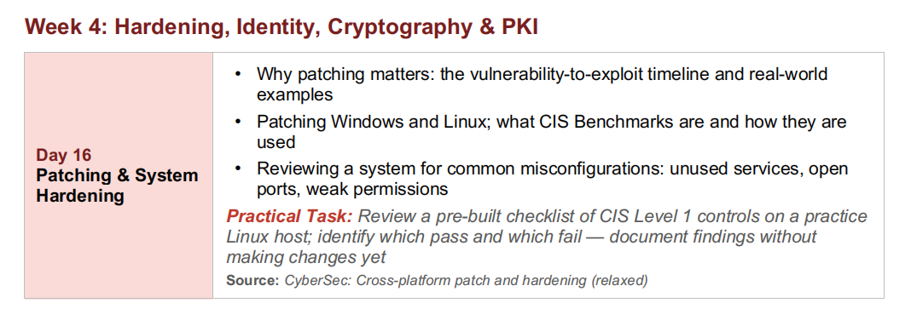

**<u>Why patching matters: the vulnerability-to-exploit timeline and
real-world examples</u>**

1.  **Why Patching Matters:-**

Patching is a fundamental component of cybersecurity because it
addresses known vulnerabilities that attackers can exploit to compromise
systems, applications, and networks. Once a vulnerability becomes
publicly known, threat actors may develop exploits and target
organizations that have not yet applied the available security updates.

Effective patch management helps organizations:

-   Reduce the attack surface by eliminating known security weaknesses.

-   Prevent exploitation of vulnerabilities before attackers can
    weaponize them.

-   Protect sensitive data from unauthorized access, theft, or
    disclosure.

-   Maintain system integrity and availability by reducing the risk of
    malware, ransomware, and system compromise.

-   Meet security and compliance requirements through timely remediation
    of known vulnerabilities.

-   Reduce organizational risk by prioritizing and addressing
    vulnerabilities based on their severity and potential impact.

2.  **The Vulnerability-to-Exploit Timeline:-**

    The Vulnerability-to-Exploit Timeline shows how a security weakness
    can go from being discovered to being used by attackers.

-   **Vulnerability Found:** A security weakness is discovered in
    software, hardware, or an application.

-   **Vulnerability Disclosed:** The issue is reported and may receive a
    **CVE number** and severity rating.

-   **Patch Released:** The company creates and releases a **security
    patch** to fix the problem.

-   **Exploit Created:** Researchers or attackers may create a **PoC or
    exploit** to show how the weakness can be used.

-   **Attack Begins:** Attackers start targeting systems that are still
    unpatched.

-   **Detection & Response:** Security teams detect the attack, apply
    the patch, and take steps to protect the system.

3.  **Real-World Examples:-**

-   **WannaCry (2017):**\
    Microsoft had already released a patch for the SMB vulnerability
    used by WannaCry. Systems that were not updated became easy targets,
    and the ransomware spread quickly.

-   **Log4Shell (2021):**\
    A serious vulnerability was found in **Log4j**, a widely used Java
    logging library. Attackers quickly searched for vulnerable systems,
    making fast patching very important.

-   **MOVEit (2023):**\
    A vulnerability in **MOVEit Transfer** was exploited by attackers to
    steal sensitive data from organizations that used vulnerable
    versions.

    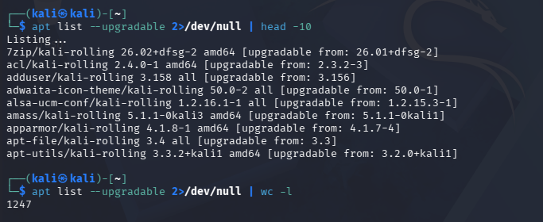

**<u>Patching Windows and Linux; what CIS Benchmarks are and how they are
used</u>**

1.  **Patching Windows:-**

    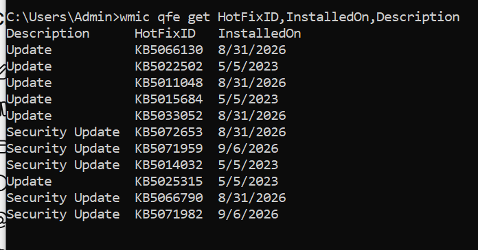

-   It used to review the Windows updates and security updates installed
    on the system.

    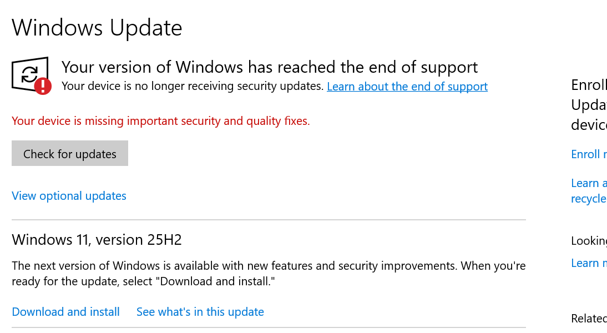

-   The Windows Update status indicates that the current Windows version
    has reached the end of support and is no longer receiving security
    updates. The system is also missing important security and quality
    fixes

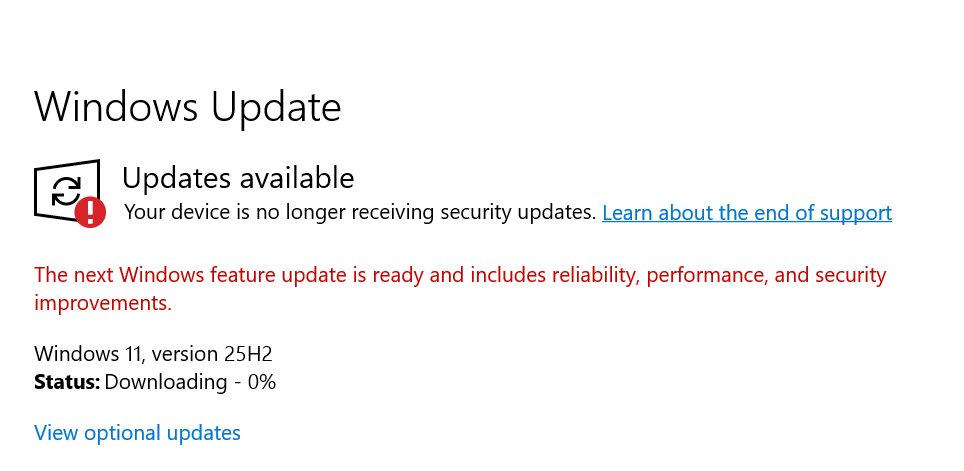

-   The Windows 11 version 25H2 feature update is being downloaded. The
    update includes reliability, performance, and security improvements.
    This demonstrates the patching process being initiated on the
    Windows system.

2.  **Patching Linux:-**

    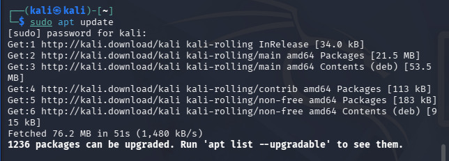

-   The output indicates that 1236 packages can be upgraded, showing
    that updates are available for the system.

    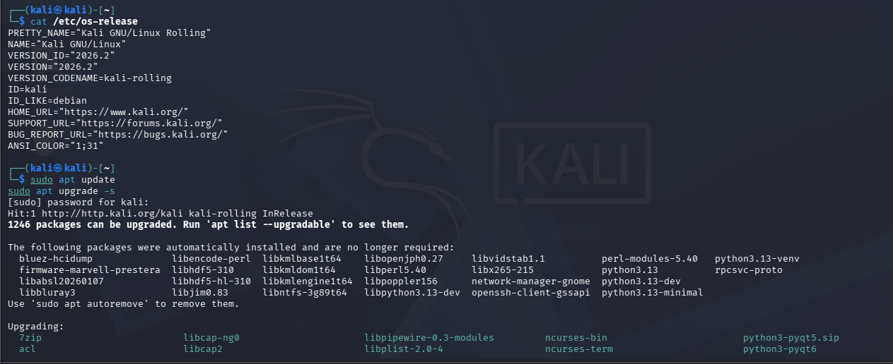

-   I first checked which Linux distribution and version was running,
    since different versions get patches differently. Then I refreshed
    the list of available software updates from the system\'s official
    sources, and simulated what would be upgraded without actually
    installing anything yet, so changes could be reviewed safely first.

3.  **what CIS Benchmarks are and how they are used:-**

    CIS Benchmarks are official rule lists made by a group called the
    Center for Internet Security. They tell you exact safe settings to
    use on a computer, like \"turn off services you don\'t need\" or
    \"make passwords at least 14 letters long\". Companies use these
    lists to set up their computers safely instead of just guessing what
    is safe.

    **Level 1:**\
    These are easy, safe settings. They work on almost any computer and
    don\'t stop normal work from happening. Most companies use these
    first.

**Level 2:**\
These are stronger, stricter settings. They are made for computers that
need extra-high security. Sometimes these settings can make normal work
harder, so they are used only when really needed.

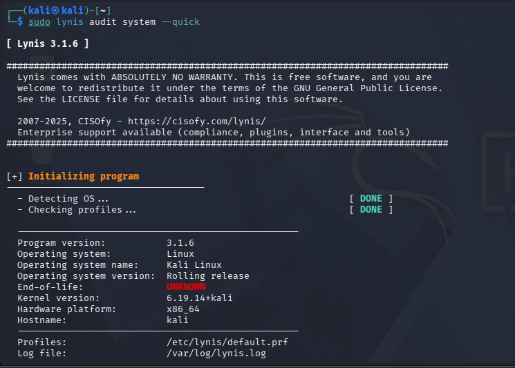

-   I ran a quick security scan using Lynis, which checks the system
    against best-practice security settings similar to what an official
    CIS Benchmark checklist would test

-   showing how these benchmarks are actually used in practice to judge
    whether a system is configured safely.

    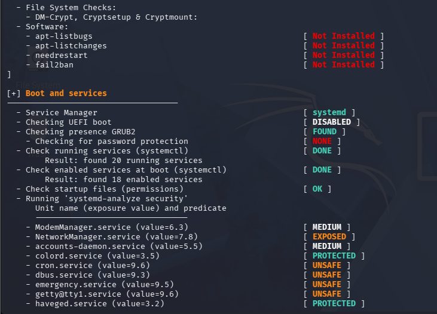

    **<u>Reviewing a system for common misconfigurations unused services,
    open ports, weak permissions:-</u>**

1.  **common misconfigurations:-**

    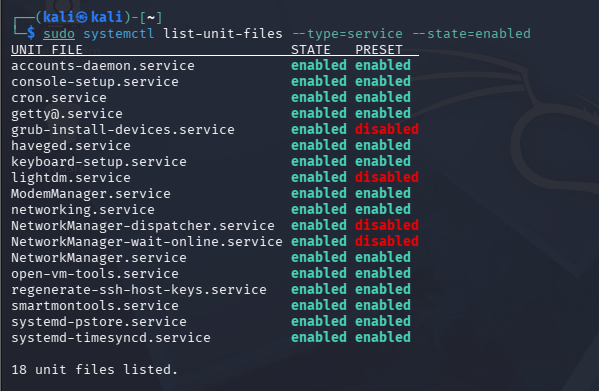

    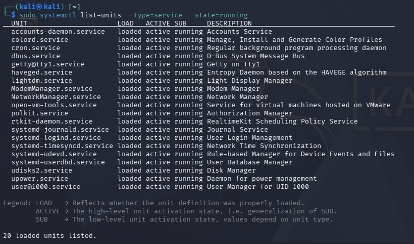

-   Unused services are programs running in the background that nobody
    actually needs, but they still take up resources and give attackers
    extra ways to try to break into the system. Checking which services
    are enabled and running helps find ones that can be safely turned
    off to reduce risk.

2.  **Open Ports:-**

    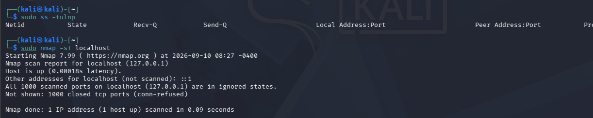

-   Open ports are like open doors into a computer every open port is a
    possible way in, so only ports that are actually needed for real
    services should be left open. Checking open ports helps identify any
    unnecessary doors that should be closed.

3.  **Weak Permissions:-**

    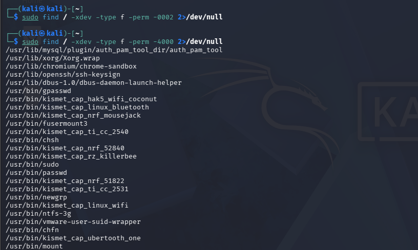

-   Weak permissions happen when files or folders are set up too openly,
    letting more people access or change them than actually should be
    allowed. Checking for world-writable files and special SUID
    permissions helps find spots where permissions may have been set
    incorrectly, leaving the system exposed.

    **<u>Practical Task: Review a pre-built checklist of CIS Level 1
    controls on a practice Linux host</u>**

    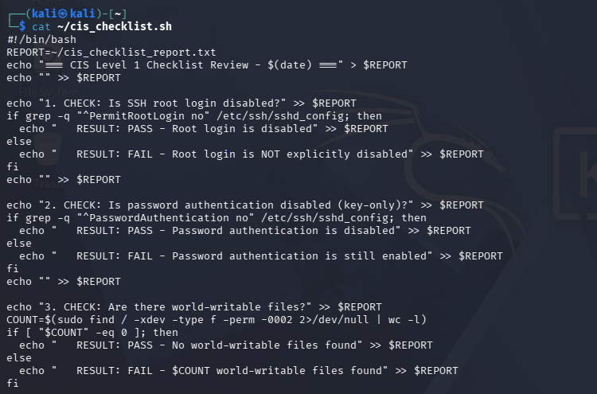

    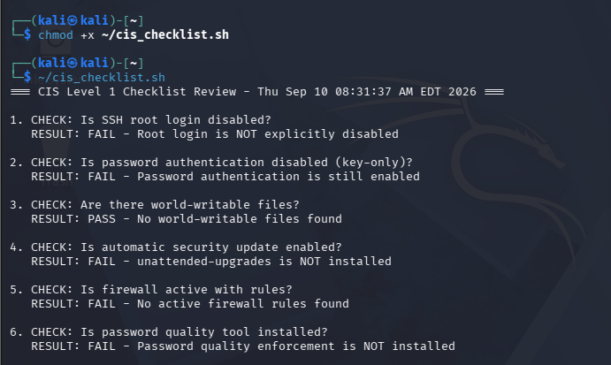

-   I wrote a script with six common CIS Level 1 checks things like
    whether root login is disabled, whether password login is turned off
    in favor of keys, whether any files are writable by everyone,
    whether automatic security updates are installed, whether the
    firewall has active rules, and whether password strength enforcement
    is installed. Running this script checks the current state of the
    system against each rule and clearly marks each one as PASS or FAIL,
    without changing anything this matches the task exactly, since we
    are only meant to identify and document the findings today, not fix
    them yet.

    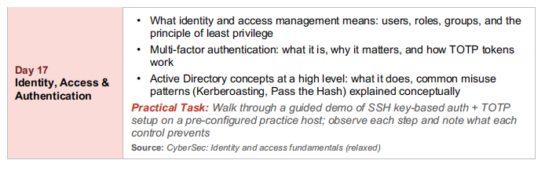

    **<u>What identity and access management means, users, roles, groups,
    and the principle of least privilege</u>**

#### **What identity and access management means:-**

####  Identity and Access Management (IAM) is the overall system of knowing who someone is when they use a computer, and controlling exactly what they are allowed to do (access). It combines checking who are you with what are you allowed to touch. {#identity-and-access-management-iam-is-the-overall-system-of-knowing-who-someone-is-when-they-use-a-computer-and-controlling-exactly-what-they-are-allowed-to-do-access.-it-combines-checking-who-are-you-with-what-are-you-allowed-to-touch. .unnumbered}

#### **Example : -** {#example-- .unnumbered}

**The Airport Journey**

-   **Identity (Authentication):** You show your passport and ticket at
    the security checkpoint. The officer checks your face against the
    photo. This proves who you are.

-   **Access (Authorization):** Once inside, your boarding pass only
    allows you onto Flight 123 and into Seat 14B. It will not let you
    board a plane to a different city, and it definitely won\'t let you
    sit in the cockpit with the pilots.

1.  **Users:-**

    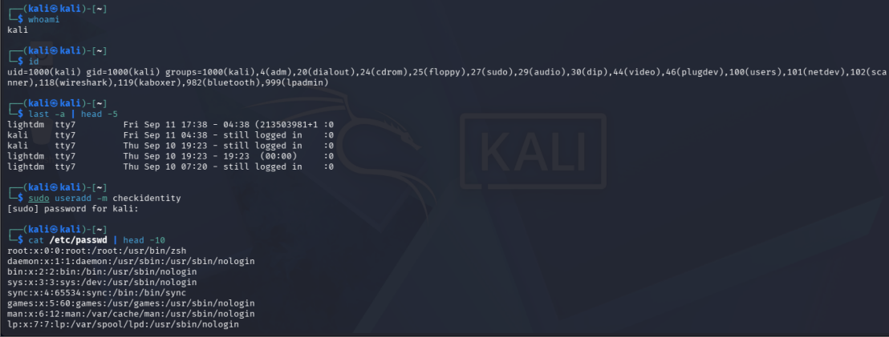

-   I checked which user I am currently logged in as, and saw it was
    kali. Then I looked at more details about my account, like its ID
    number and all the groups it belongs to, such as sudo and bluetooth.
    After that, I checked who had recently logged into the computer and
    when. I also made a new user called checkidentity to practice
    creating accounts. Finally, I looked at the list of user accounts
    stored on the computer, which showed both real users like kali and
    checkidentity .

    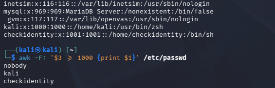

    **Roles:-**

    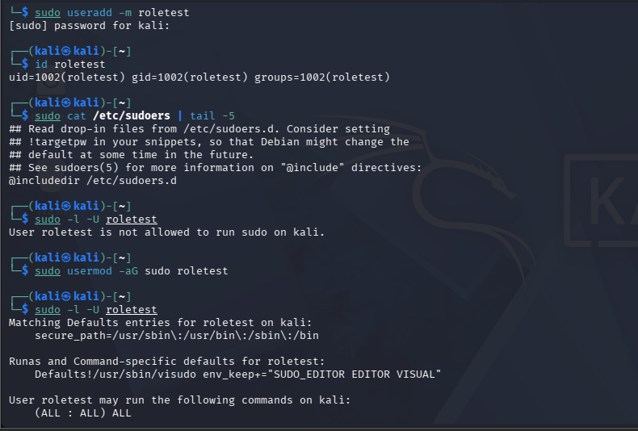

-   I created a new user called roletest who by default only had a basic
    limited role with no special powers then i looked at the file that
    decides which users are allowed to act as admin on the system and
    checked exactly what roletest was currently allowed to do which
    showed it had no admin role yet after that i gave roletest the admin
    role by adding it to the sudo group and checked again to confirm it
    now had full admin permissions this clearly showed the difference
    between a regular role which can only do basic tasks and an admin
    role which can do almost anything on the system

    **Groups:-**

    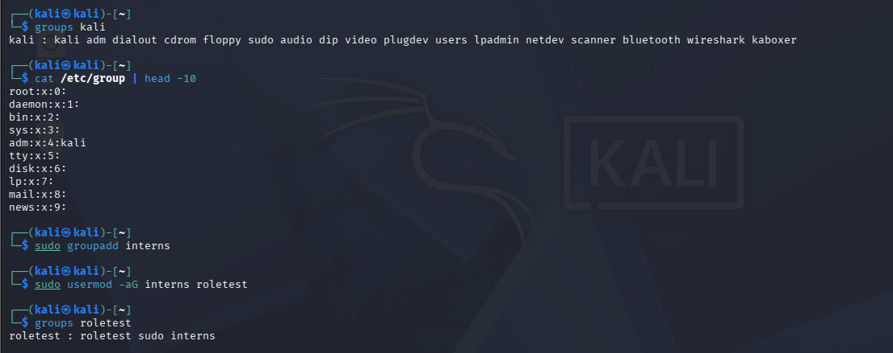

-   i checked which groups my own account belongs to then looked at the
    full list of groups that exist on the system a group is a collection
    of users who all share the same permissions together instead of
    setting permissions one by one for each user so i created a new
    group called developers and added the roletest user into it then
    checked again to confirm roletest now belongs to that group this
    shows how groups are used to manage permissions for many users at
    once instead of changing each user separately.

    **The principle of least privilege:-**

    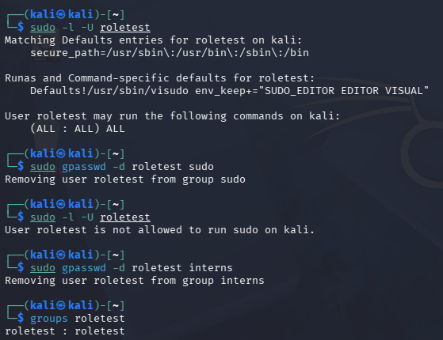

-   i checked what admin access roletest currently had then removed it
    from the sudo group taking back the extra admin power it did not
    really need and checked again to confirm the admin access was gone i
    also removed it from the developers group since it no longer needed
    that access either and confirmed the final groups it belongs to now
    the principle of least privilege means every user should only be
    given the exact access they actually need to do their job and
    nothing more so if their account is ever hacked or misused the
    damage stays limited because they never had extra power to begin
    with.

    **<u>Multi-factor authentication --- what it is, why it matters, and
    how TOTP tokens work</u>**

    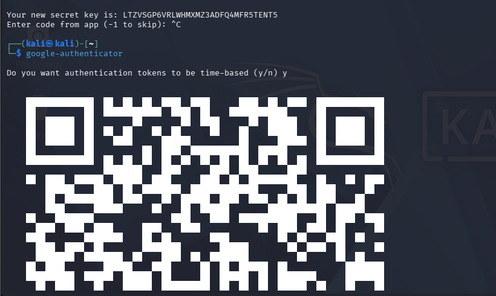

    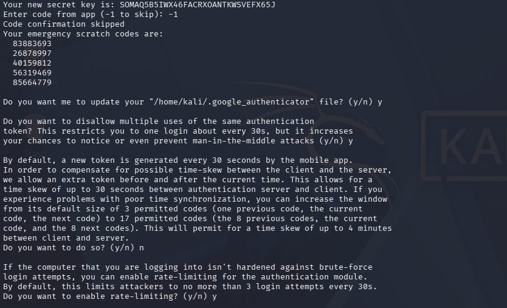

    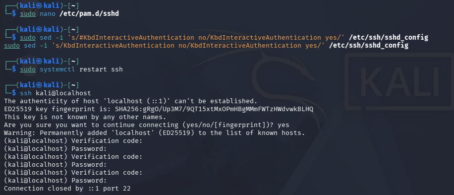

-   I installed a tool called google authenticator which lets the
    computer create and check totp codes for logging in, totp means time
    based one time password and it generates a new 6 digit code every 30
    seconds using a shared secret key and the current time so both a
    phone app and the server can calculate the same code at the same
    moment without sending anything over the internet i ran the setup
    which showed a qr code and a secret key, answered yes to keep it
    secure by not allowing the same code twice, keeping the tighter 30
    second time window, and turning on rate limiting so an attacker
    cannot keep guessing codes over and over then i added a line into
    the ssh login settings telling it to also ask for a totp code in
    addition to the normal login and turned on the setting that allows
    ssh to ask this extra question after restarting ssh and trying to
    log in again it correctly asked for the normal password first and
    then it will ask for the verification code from the authenticator
    app before letting anyone in which proves multi factor
    authentication is now working, this matters because even if someone
    steals or guesses the password they still cannot get in without also
    having the changing code from the actual device.

    **<u>Active Directory concepts at a high level --- what it does,
    common misuse patterns (Kerberoasting, Pass the Hash) explained
    conceptually</u>**

    **1.What Active Directory does:**\
    active directory is a system that keeps track of every user and
    computer in a company and controls who can log in and what they can
    access .

    **Example:-**

    A company has 500 employees and instead of setting up each computer
    separately the it team manages everyones login from one central
    system.

    **2.Kerberoasting :-**\
    kerberoasting is when an attacker asks for a special ticket tied to
    a service accounts password then takes it away to crack the password
    quietly on their own computer.

    **Example:-**

    An attacker with basic network access requests a ticket for an old
    service account that has a weak password like summer2020 and cracks
    it within hours to gain that accounts access.

2.  **Pass the Hash:-**\
    pass the hash is when an attacker steals the scrambled version of a
    password instead of the real password and uses that scrambled
    version directly to log in.

    **Example:-**

    an attacker hacks one employee computer finds a stored password hash
    in memory and uses it to log into other computers on the network as
    an admin without ever knowing the actual password.

    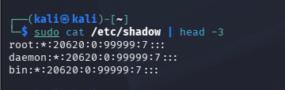

-   It shows how linux stores passwords in a hashed form, similar in
    concept to how windows stores password hashes which is exactly the
    kind of data an attacker targets in a pass the hash attack

    **<u>Practical Task: Walk through a guided demo of SSH key-based
    auth + TOTP setup on a pre-configured practice host; observe each
    step and note what each control prevents</u>**

    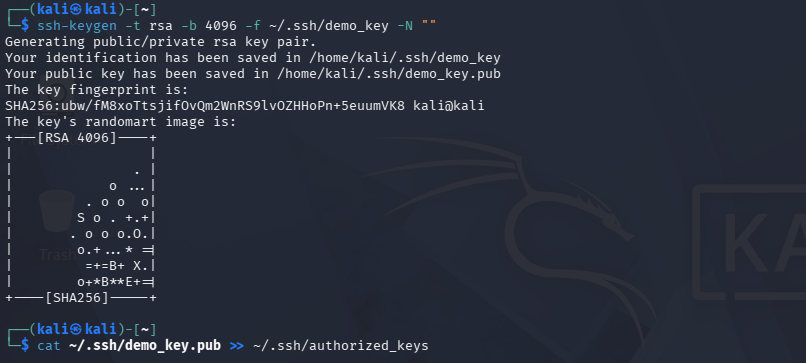

    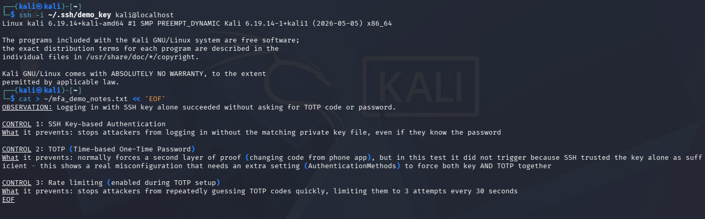

    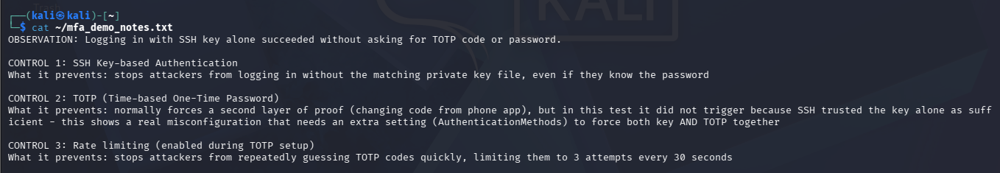

-   i tried logging in using only the ssh key and found that it logged
    me straight in without asking for a password or the totp code, this
    is an important real finding because it shows that by default ssh
    trusts the key alone as enough proof and skips the extra totp step,
    in a real security review this would be flagged as a
    misconfiguration since the goal of mfa is to require two different
    proofs not just one, the fix would be adding a setting called
    authentication methods in the ssh config to force both the key and
    the totp code together, this observation itself is valuable because
    it shows why testing security controls is important even after
    setting them up, since they may not work exactly as expected.

    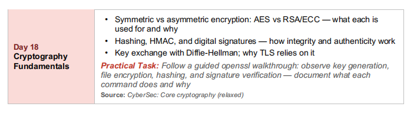

    **<u>Symmetric vs asymmetric encryption --- AES vs RSA/ECC, what each
    is used for and why</u>**

    **Symmetric encryption (AES):**

    symmetric encryption uses the same single key to both encrypt and
    decrypt data its fast and good for encrypting large amounts of data.

    **Example:-**

    when you encrypt a whole file or hard drive aes is normally used
    because its quick even on big files.

    **Asymmetric encryption (RSA/ECC):**

    Asymmetric encryption uses two different but linked keys a public
    key that anyone can have to lock data and a private key that only
    the owner has to unlock it, its slower than symmetric but solves the
    problem of sharing a secret key safely.

    **Example:-**

    when you visit a https website rsa or ecc is used at the start of
    the connection to safely agree on a shared key without ever sending
    that key directly over the network.

    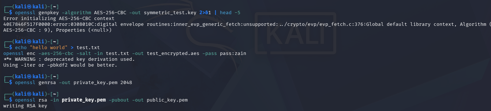

    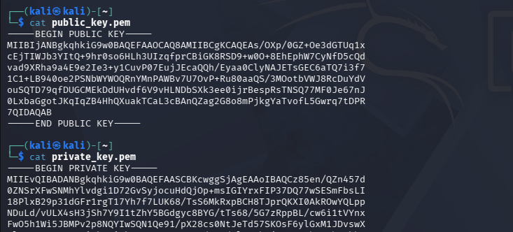

-   I encrypted a small text file using aes with a password, aes is a
    symmetric method meaning the exact same password is used to both
    lock and unlock the file, this shows why symmetric encryption is
    fast and good for encrypting actual data itself like files or hard
    drives, then i generated an rsa key pair which is asymmetric meaning
    it creates two separate linked files a private key that must stay
    completely secret and a public key that can be shared freely with
    anyone, i then displayed the public key to show it can be safely
    given out, this shows why asymmetric encryption is used for safely
    exchanging information between people who have never met before,
    since its slower than symmetric but solves the problem of sharing a
    secret safely without sending it directly.

    **<u>Hashing, HMAC, and digital signatures --- how integrity and
    authenticity work</u>**

**Hashing:**\
hashing takes any piece of data and turns it into a fixed length
scrambled code, the same input always gives the same output but you
cannot reverse it back to the original data, its used to check if a file
has been changed since even a tiny change completely changes the hash

**HMAC:**\
hmac is hashing combined with a secret key, it proves not just that data
wasnt changed but also that it came from someone who actually knows the
secret key, so its used when you need to trust both the integrity and
the source of a message

**Digital signatures:**\
digital signatures use a private key to sign data and a public key to
verify it, they prove the data really came from the claimed sender and
wasnt changed since only the real private key owner could have created
that exact signature

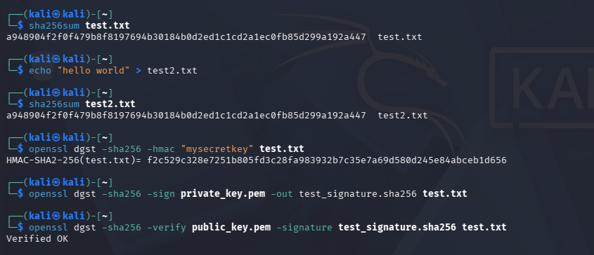

-   I generated a hash of the test file and then made an identical
    second file and hashed it too to show that the exact same content
    always produces the exact same hash, which is how hashing checks if
    a file was changed, then i made an hmac of the file using a secret
    key which proves both that the data wasnt changed and that whoever
    made it actually knows the shared secret, finally i signed the file
    using the private rsa key and then verified that signature using the
    matching public key, getting a successful verification proves the
    file really was signed by the real private key owner and wasnt
    tampered with afterward.

    **<u>Key exchange with Diffie-Hellman; why TLS relies on
    it</u>**

**Diffie-Hellman:**\
Diffie hellman lets two people agree on the same secret key without ever
sending that key over the network, each side makes their own private
number and shares only a public value, then combines the other persons
public value with their own private number, both sides end up with the
exact same secret even though nobody watching ever saw it.

**Why TLS uses it:**\
Tls uses this at the start of every https connection so your browser and
a website can agree on a key safely, this way even if someone records
the traffic and steals the server key later they still cant unlock old
messages, because each connection made its own temporary key.

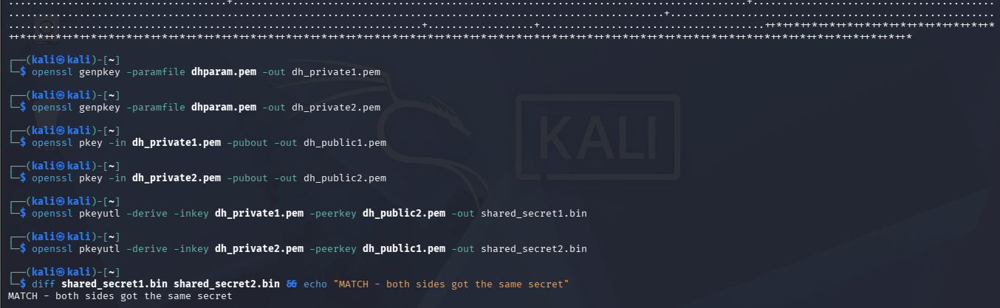

-   I made two separate private and public key pairs to act like two
    different people, then each side calculated a shared secret using
    their own private key and the other persons public key, comparing
    the two results showed they matched, proving both sides reached the
    same secret key without it ever being sent directly over the
    network, this is the same thing tls does at the start of every https
    connection.

    **<u>Practical Task: Follow a guided openssl walkthrough --- observe
    key generation, file encryption, hashing, and signature
    verification; document what each command does and why</u>**

    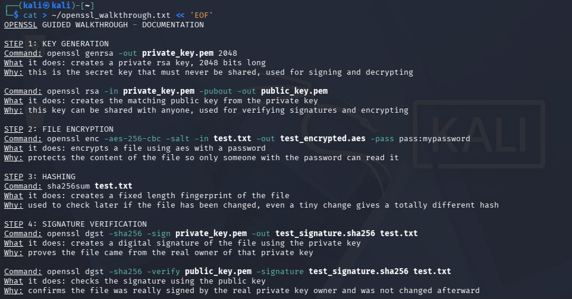

    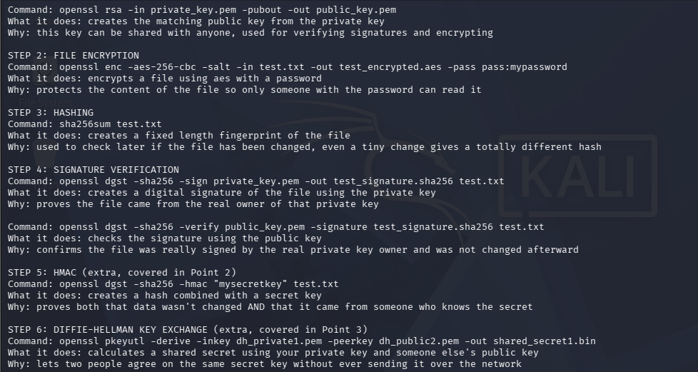

-   I put together a documentation file that walks through the whole
    openssl process step by step, starting with generating a private and
    public key pair, then encrypting a file with aes to protect its
    content, then creating a hash to fingerprint the file so changes
    could be detected, and finally creating and verifying a digital
    signature to prove the file really came from the real key owner and
    wasnt tampered with, each step in the file explains what the command
    does and why it matters, this documents the full guided walkthrough
    exactly as the task asked for.

    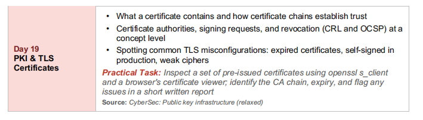

    **<u>What a certificate contains and how certificate chains establish
    trust</u>**

    A certificate is like a digital id card for a website, it contains
    the website\'s name, its public key, who issued the certificate, and
    how long its valid for, a certificate chain works because
    certificates are signed by other certificates, your browser trusts a
    small list of top level authorities called root cas, they sign
    intermediate certificates, which then sign the actual website
    certificate, so trust flows down the chain from something your
    browser already trusts.

    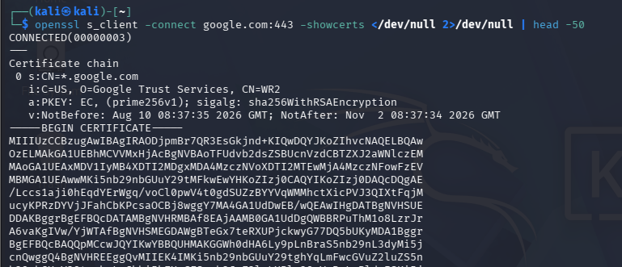

    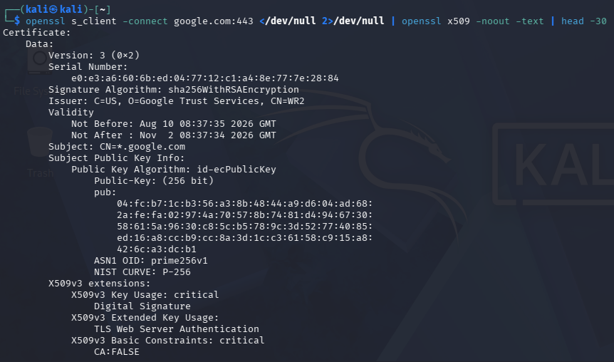

    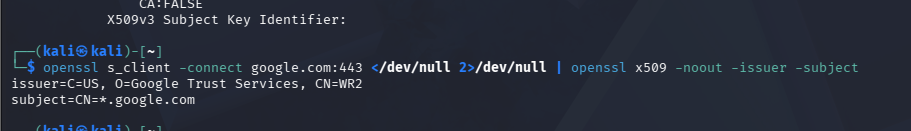

-   I connected to a real website and looked at its full certificate
    chain, a certificate is like a digital id card for a website that
    contains its name, its public key, who issued it, and how long its
    valid for, i then looked inside the certificate to see these exact
    details like the domain name and validity dates, and finally checked
    just the issuer and subject lines which show the chain of trust, a
    certificate chain works because certificates are signed by other
    certificates, browsers already trust a small list of top level
    authorities called root cas, those sign intermediate certificates,
    which then sign the actual website certificate, so trust flows down
    step by step from something the browser already trusts to the final
    website certificate.

    **<u>Certificate authorities, signing requests, and revocation (CRL
    and OCSP)</u>**

    **Certificate Authorities:-**

    A certificate authority is a trusted company that checks if you
    really own a domain and then issues you a signed certificate,
    browsers and operating systems come with a built in list of trusted
    cas, so any certificate signed by one of them is automatically
    trusted.

    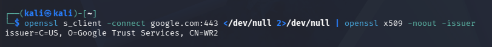

#### Signing Requests (CSR):- {#signing-requests-csr- .unnumbered}

A certificate signing request is a file you create containing your
public key and domain info, you send this to a ca, and they use it to
create your actual signed certificate, you never send your private key
to anyone, only the public key inside the csr.

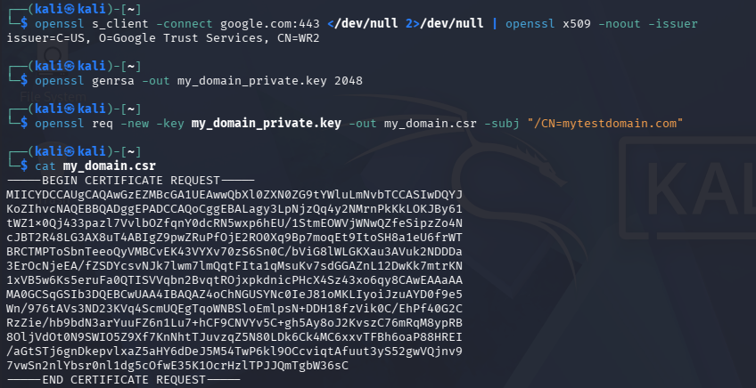

-   The first command creates a private key, the second creates the csr
    using that key, and the third shows the actual csr content which is
    normally sent to a real certificate authority to get a certificate
    issued.

    **Revocation (CRL and OCSP):-**

    Sometimes a certificate needs to be cancelled before it expires,
    like if the private key gets stolen, crl is a list the ca publishes
    of all cancelled certificates that browsers can download and check,
    ocsp is a faster method where the browser directly asks the ca in
    real time if one specific certificate is still valid, ocsp is more
    common today because its quicker than downloading a whole list.

    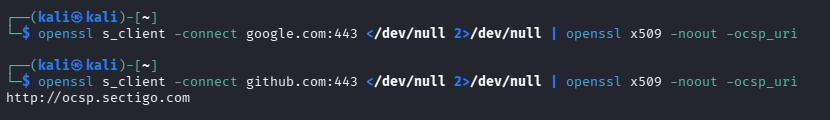

-   It shows the ocsp address included in a real certificate, which
    browsers use to check in real time if that certificate has been
    revoked.

    **<u>Spotting common TLS misconfigurations --- expired certificates,
    self-signed in production, weak ciphers</u>**

    **Expired Certificates:-**

    An expired certificate means the website\'s certificate has passed
    its valid end date, every certificate has a \"not before\" date when
    it starts being valid and a \"not after\" date when it stops being
    valid, once past that end date browsers will show a big warning and
    block the connection because they can no longer guarantee the site
    is safe, this can happen when an admin simply forgets to renew a
    certificate in time.

    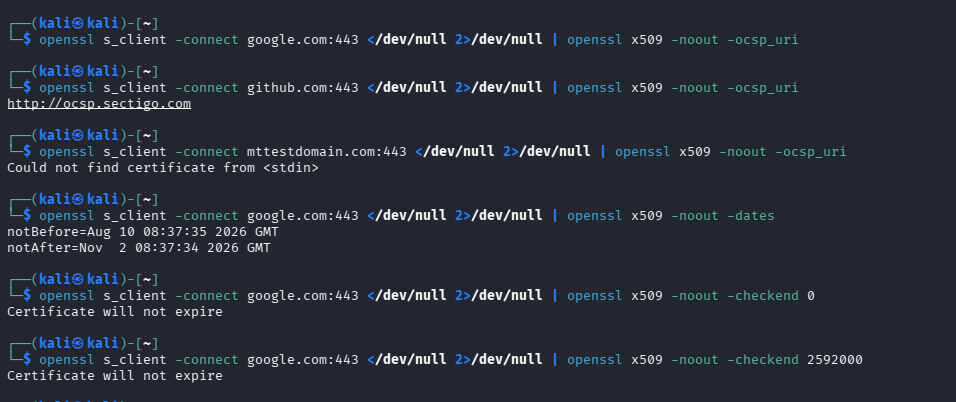

-   I checked the certificate\'s start and end validity dates to see how
    long it is valid for, then directly checked if it has already
    expired right now, and also checked if it will expire within the
    next 30 days, this is exactly how real monitoring tools warn admins
    in advance before a certificate actually expires so they can renew
    it in time.

    **Self-signed Certificates in Production:-**

    A self signed certificate is one where a website creates and signs
    its own certificate instead of getting it from a trusted certificate
    authority, this is fine for testing on your own computer but if
    found on a real live public website it means browsers wont trust it
    and will show a big warning to every visitor.

    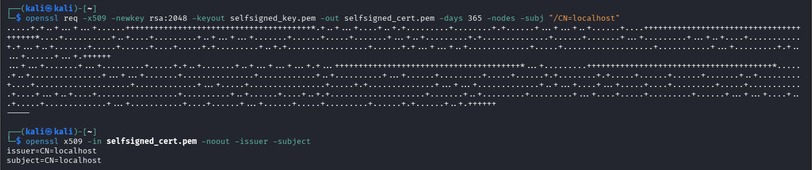

-   I created a self signed certificate myself to see what one looks
    like, where the website signs its own certificate instead of getting
    it from a trusted ca, then i checked the issuer and subject of that
    certificate and saw they were exactly the same, which is the clear
    giveaway sign of a self signed certificate, since a real ca issued
    certificate would always show a different issuer than the website
    itself, this is fine for testing but a serious misconfiguration if
    found on a real live public website.

    **Weak Ciphers:-**

    A weak cipher is an old outdated encryption method that can be
    broken more easily than modern ones, i tried connecting using a
    known weak cipher and listed other weak ciphers, a properly
    configured server should refuse these old ciphers and only accept
    strong modern ones.

    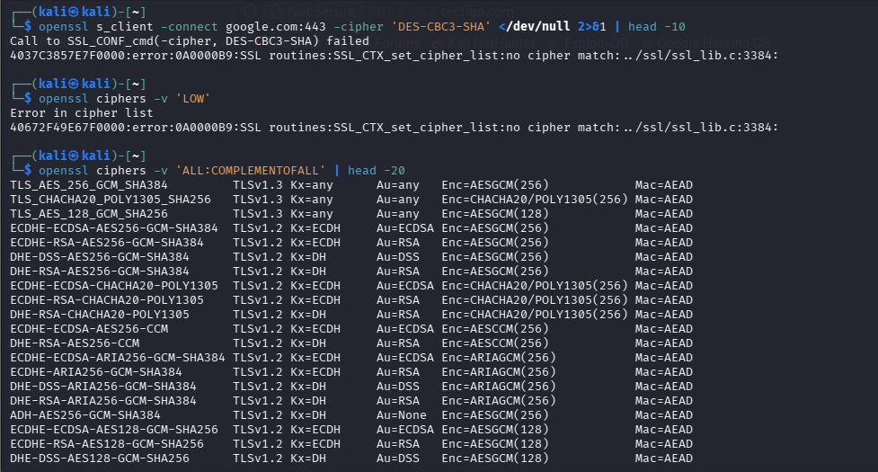

-   I tried to list weak old ciphers and connect using one of them, but
    the system refused because modern openssl has completely removed
    support for these old, insecure ciphers, this is actually a good
    sign since it proves the system only allows strong modern encryption
    and automatically blocks outdated weak ciphers that could be broken
    more easily by an attacker, a properly configured server should
    behave exactly this way.

    **<u>Practical Task: Inspect a set of pre-issued certificates using
    openssl s_client and a browser\'s certificate viewer; identify the
    CA chain, expiry, and flag any issues in a short written
    report</u>**

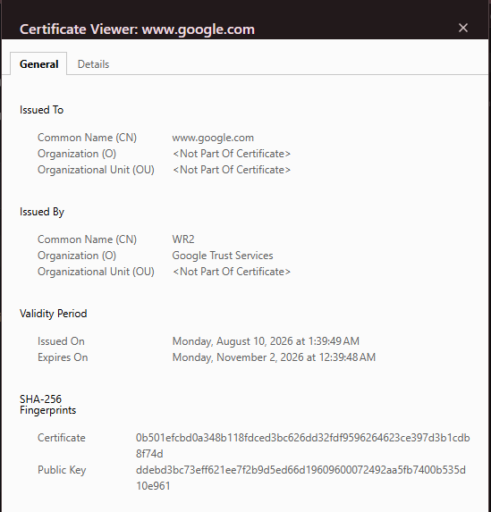

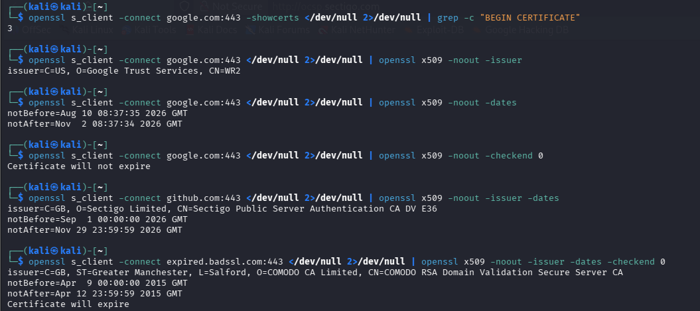

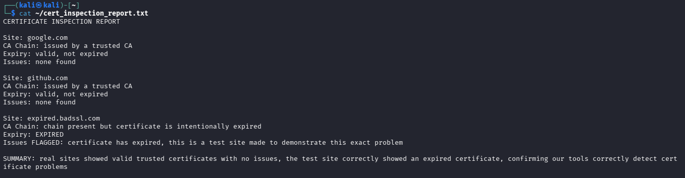

-   I checked how many certificates were in the trust chain for a real
    website, then looked at who issued it and its validity dates, and
    directly checked if it had expired yet, i did the same checks on a
    second real website and also on a special test website that is
    intentionally set up with an expired certificate, i also opened one
    of these sites in a browser and viewed its certificate through the
    browser\'s own certificate viewer by clicking the lock icon, finally
    i wrote all these findings into a short report listing the ca chain,
    expiry status, and any issues found for each site, the real websites
    showed valid trusted certificates while the test site correctly
    showed the expired certificate problem it was designed to
    demonstrate.

### 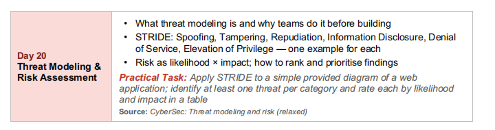 {#section .unnumbered}

###  {#section-1 .unnumbered}

### <u>What threat modeling is and why teams do it before building</u> {#what-threat-modeling-is-and-why-teams-do-it-before-building .unnumbered}

**Threat modeling:**\
Threat modeling means thinking through all the ways something could be
attacked before you actually build it

**Why teams do it:**\
Its much cheaper and easier to fix a security problem on paper during
planning than after the app is already built and live, doing it early
catches problems before they become real damage

**Example:**\
A team planning a new login page sits down and asks what if someone
tries to guess passwords over and over, this leads them to add a limit
on login attempts before writing any code, instead of discovering the
problem later after hackers already tried it on the real live site.

**<u>STRIDE --- Spoofing, Tampering, Repudiation, Information Disclosure,
Denial of Service, Elevation of Privilege</u>**

### STRIDE:- {#stride- .unnumbered}

STRIDE is a framework (a structured method) that security teams use to
find and categorize possible threats in any system before it\'s built.
It breaks threats down into six specific categories, so nothing
important gets missed --- each letter stands for one category:

-   **S** --- Spoofing

-   **T** --- Tampering

-   **R** --- Repudiation

-   **I** --- Information Disclosure

-   **D** --- Denial of Service

-   **E** --- Elevation of Privilege

**1. Spoofing**\
Pretending to be someone or something else to gain trust or access.\
Example: An attacker sends a fake email pretending to be your bank to
steal your password.

**2. Tampering:**

Changing or modifying data without permission.\
Example: An attacker secretly changes the contents of a file while it is
being downloaded.

**3. Repudiation**\
Denying that an action happened because there is no proof or record of
it.\
Example: A user deletes important files, and since there are no logs,
they deny ever doing it.

**4. Information Disclosure**\
Exposing private information to people who should not see it.\
Example: A website error message accidentally shows a database password
to visitors.

**5. Denial of Service**\
Making a system unavailable to its real users.\
Example: An attacker floods a website with fake traffic so real
customers cannot access it.

**6. Elevation of Privilege**\
Gaining more access or permission than you are supposed to have.\
Example: A regular user finds a bug that lets them use admin-only
features without being an admin.

**<u>Risk as likelihood × impact; how to rank and prioritise
findings</u>**

-   **Likelihood:**

likelihood means how probable it is that a specific threat will actually
happen,\
**Example:** a website with no login attempt limit has high likelihood
of being brute-forced, since its easy for an attacker to try.

#### Impact:

Impact means how much damage would be caused if the threat actually
happened\
**Example:** a threat that leaks a customer\'s full payment details has
very high impact, since it can cause serious financial and legal harm.

#### Risk = Likelihood × Impact

Risk score is calculated by multiplying likelihood and impact together,
usually each scored from 1 to 5.\
Example: a threat with likelihood 4 and impact 5 gets a risk score of
20, which is high risk and should be fixed urgently.

-   **How to Rank and Prioritise Findings**

    After calculating risk scores for every threat found, they are
    sorted from highest to lowest, and the team fixes the highest
    scoring threats first since those are the most dangerous.

  --------------------------------------------------------------------------------
  **Threat**                   **Likelihood   **Impact    **Risk    **Priority**
                               (1-5)**        (1-5)**     Score**   
  ---------------------------- -------------- ----------- --------- --------------
  Weak password allows admin   4              5           20        Fix first
  login                                                             

  Old test file leaks harmless 1              1           1         Fix last
  data                                                              
  --------------------------------------------------------------------------------

**<u>Practical Task: Apply STRIDE to a simple provided diagram of a web
application; identify at least one threat per category and rate each by
likelihood and impact in a table</u>**

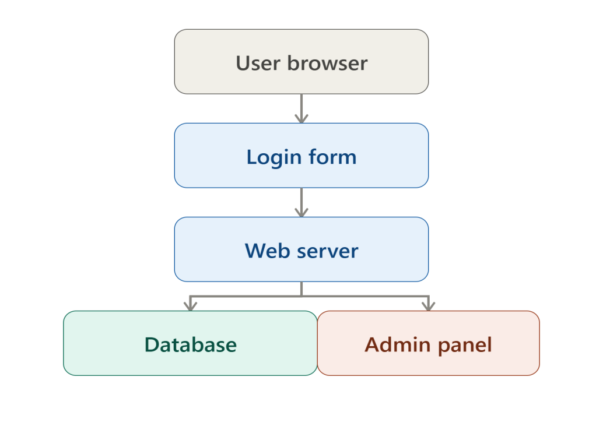

  -------------------------------------------------------------------------------------
  **STRIDE      **Where in  **Threat**              **Likelihood   **Impact   **Risk
  Category**    diagram**                           (1-5)**        (1-5)**    Score**
  ------------- ----------- ----------------------- -------------- ---------- ---------
  Spoofing      Login Form  attacker creates a fake 4              4          16
                            copy of the login form                            
                            to steal user                                     
                            credentials before they                           
                            reach the real web                                
                            server                                            

  Tampering     Web Server  attacker intercepts and 3              4          12
                Database    modifies data between                             
                            the web server and                                
                            database                                          

  Repudiation   Admin Panel admin makes changes in  2              3          6
                            the admin panel with no                           
                            activity logging, later                           
                            denies making the                                 
                            change                                            

  Information   Database    database returns        3              5          15
  Disclosure                detailed error messages                           
                            that accidentally leak                            
                            table structure or                                
                            passwords                                         

  Denial of     Web Server  attacker floods the web 3              4          12
  Service                   server with fake login                            
                            requests, making it                               
                            unavailable to real                               
                            users                                             

  Elevation of  Admin Panel a regular logged-in     2              5          10
  Privilege                 user finds a way to                               
                            access the admin panel                            
                            without proper admin                              
                            rights                                            
  -------------------------------------------------------------------------------------

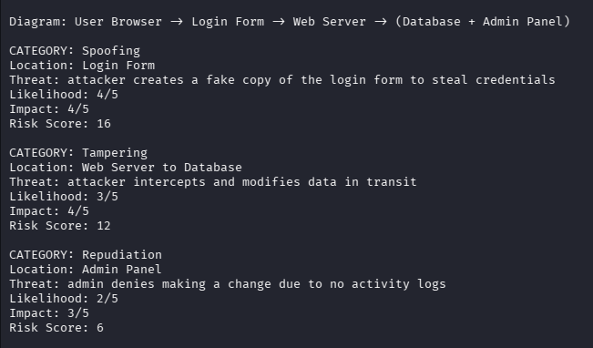

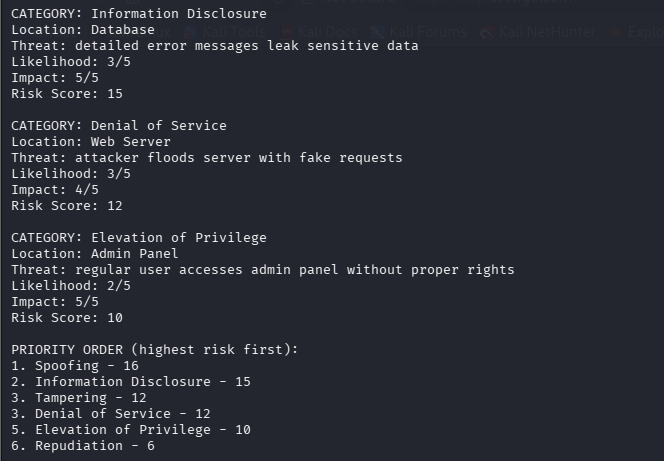

I looked at the web application diagram showing a user browser
connecting through a login form to a web server, which then connects to
a database and an admin panel, and went through each of the six stride
categories to find a specific threat at a specific point in this
diagram, for example the login form is the natural place for a spoofing
attack since it directly handles login credentials, and the admin panel
is the natural place for an elevation of privilege threat since it holds
the most sensitive access, i rated each threat by likelihood and impact
and multiplied them to get a risk score, sorting by score showed that
spoofing the login form and information disclosure from the database
were the most urgent threats to fix first, while repudiation in the
admin panel was the least urgent.
