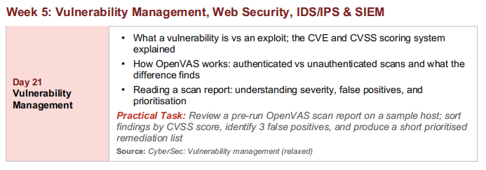

1.  **<u>What a vulnerability is vs an exploit; the CVE and CVSS scoring
    system explained:</u>**

-   **Vulnerability:**\
    A weakness or flaw in software or a system that could potentially be
    attacked.\
    **Example:**

-   An outdated web application that has a known bug allowing
    unauthorized access.

-   **Exploit:**\
    The actual tool, code, or technique used to take advantage of a
    vulnerability\
    **Example:**

-   A script that specifically uses that outdated app\'s bug to break in
    and steal data

### Vulnerability vs Exploit:

  --------------------------------------------------------------------------
  **Aspect**   **Vulnerability**          **Exploit**
  ------------ -------------------------- ----------------------------------
  What it is   A weakness or flaw in      The actual tool or technique used
               software/system            to take advantage of that weakness

  State        Passive - just sitting     Active - someone is actually using
               there, may never be used   it to attack

  Example      An outdated app with a     A script that uses that bug to
               known bug                  break in and steal data

  Analogy      An unlocked door           Someone actually walking through
                                          the unlocked door

  Identified   CVE number                 Exploit code/proof-of-concept
  by                                      

  Danger level Depends on if it gets      Directly causes damage when used
               exploited                  
  --------------------------------------------------------------------------

-   **CVE (Common Vulnerabilities and Exposures):**\
    A public, standardized ID number given to a specific known
    vulnerability, so everyone in the security world refers to the same
    issue with the same name.\
    **Example:**

-   CVE-2021-44228 is the ID for the famous Log4Shell vulnerability

-   **CVSS (Common Vulnerability Scoring System):**\
    A standard scoring system from 0 to 10 that rates how severe a
    vulnerability is, based on things like how easy it is to exploit and
    how much damage it could cause\
    **Example:**

-   A vulnerability scored 9.8 is considered critical and needs fixing
    immediately, while one scored 2.0 is low priority

-   **CVSS Severity Ranges :**

-   0.1 - 3.9 = Low

-   4.0 - 6.9 = Medium

-   7.0 - 8.9 = High

-   9.0 - 10.0 = Critical

### <u>How OpenVAS works --- authenticated vs unauthenticated scans and what the difference finds:</u>

-   **OpenVAS :**\
    OpenVAS is a free, open-source tool that automatically scans
    computers and networks to find known vulnerabilities, comparing what
    it finds against a huge database of known issues.

-   **How it works :**\
    you point OpenVAS at a target (like a server or website), it scans
    the target checking for open ports, running software versions, and
    known weaknesses, then it gives you a report listing everything it
    found along with a severity score for each

-   **Unauthenticated Scan:**\
    A scan done without any login credentials, checking the target only
    from the outside, exactly like an attacker with no access would see
    it\
    **Example:** OpenVAS checks a website\'s open ports and outdated
    software versions just by looking from outside, without logging in.

-   **Authenticated Scan:**\
    A scan done with login credentials given to OpenVAS, allowing it to
    actually log into the system and check things from the inside\
    **Example:** OpenVAS logs into a server with a username and password
    and checks internal things like installed software versions, missing
    patches, and misconfigured settings.

### Authenticated vs Unauthenticated Scan :

  -------------------------------------------------------------------------
  **Aspect**    **Unauthenticated Scan**     **Authenticated Scan**
  ------------- ---------------------------- ------------------------------
  Login         Not used                     Used (username/password given
  credentials                                to scanner)

  View of the   From outside only            From inside, like a logged-in
  system                                     user

  What it sees  Open ports, exposed          Internal software versions,
                services, outdated software  missing patches, misconfigured
                visible externally           settings

  Realism       Matches what a real external Matches what an insider or
                attacker would see           attacker with stolen
                                             credentials could see

  Number of     Fewer findings               More findings (deeper
  findings                                   visibility)

  Speed         Usually faster               Usually slower (more to check)
  -------------------------------------------------------------------------

2.  **<u>Reading a scan report --- understanding severity, false
    positives, and prioritisation:</u>**

-   **Severity:**\
    how serious a found vulnerability is, usually shown as a CVSS score
    and a label like Low, Medium, High, or Critical\
    **Example:** a Critical severity finding means it needs to be fixed
    immediately, while a Low severity finding can wait

-   **False Positive:**\
    Definition: when a scan report says something is a vulnerability,
    but after checking it\'s actually not really a problem (the tool
    made a mistake)\
    **Example:** OpenVAS flags a service as vulnerable based on its
    version number, but the admin already applied a manual patch that
    the scanner didn\'t detect, so it\'s not really vulnerable anymore

-   **Why false positives matter:**\
    if you fix things blindly based on the report without checking, you
    might waste time on issues that don\'t actually exist, so every
    finding should be manually verified before spending time fixing it

-   **Prioritisation:**\
    Definition: deciding which findings to fix first, based mainly on
    severity score, but also considering how exposed the system is and
    how important it is.\
    **Example:** A Critical finding on a public-facing web server should
    be fixed before a Medium finding on an internal test machine that
    nobody can reach from outside

-   **Simple prioritisation order:**

1.  Critical findings (fix immediately)

2.  High findings (fix soon)

3.  Medium findings (schedule a fix)

4.  Low findings (fix when convenient)

5.  False positives (no fix needed, just document and ignore)

**<u>Practical Task:</u>**

**<u>Review a pre-run OpenVAS scan report on a sample host; sort findings
by CVSS score, identify 3 false positives, and produce a short
prioritised remediation list</u>**

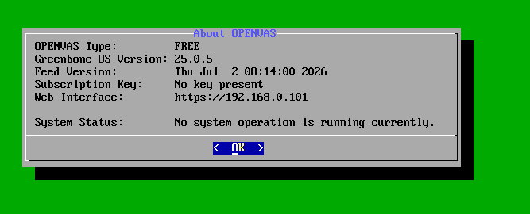

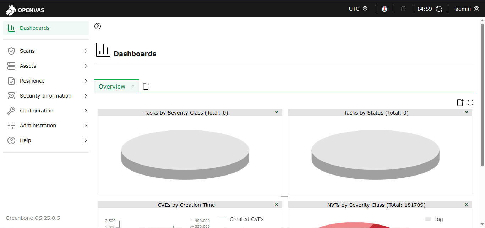

-   I downloaded the official pre-configured openvas free virtual
    machine as an ova file directly from greenbone\'s website then
    imported it into vmware workstation and powered it on.

-   I logged into the appliance\'s console using the default admin
    username and password, which opened a setup wizard where i created a
    new web administrator account and skipped the paid enterprise
    subscription key since we are using the free community feed, the
    appliance then showed me its web interface address, which i opened
    in a browser and successfully logged into the full gvm dashboard.

-   This pre built appliance came with all 181,709 vulnerability checks
    already properly loaded, unlike the manual installation which had
    repeated feed synchronization problems.

    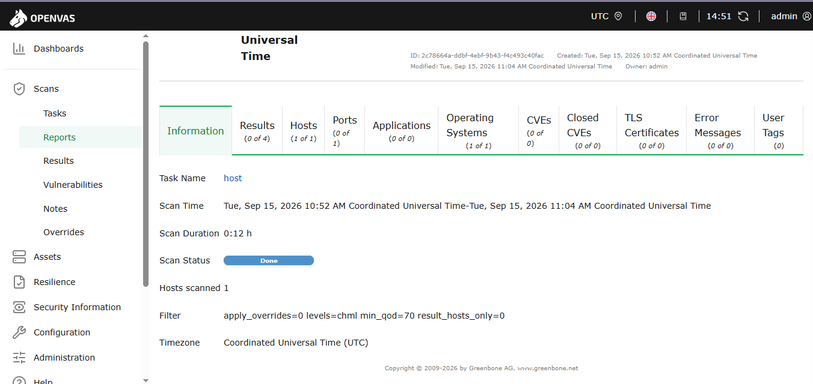

-   four log-level findings were found on the windows host: os
    detection, a traceroute path, an unknown service on port 7680, and
    the hostname of the machine, all marked as \"log\" (informational)
    not as actual vulnerabilities

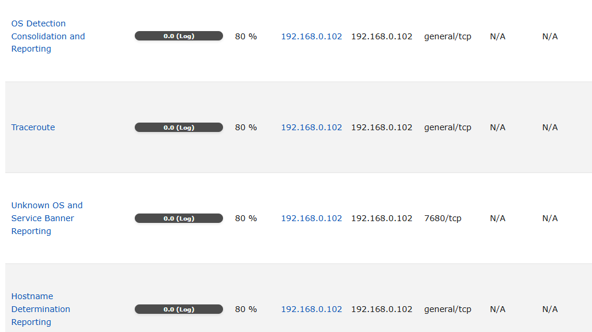

-   the scan targeted 192.168.0.102, took 12 minutes to complete (10:52
    AM to 11:04 AM), status shows \"Done\", and only 1 host was scanned
    in total

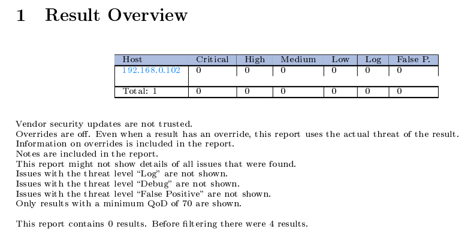

-   the summary table shows 0 critical, 0 high, 0 medium, 0 low, and 0
    false positive findings, with all 4 results falling under the
    \"log\" category, meaning no real security vulnerabilities were
    detected on this windows machine

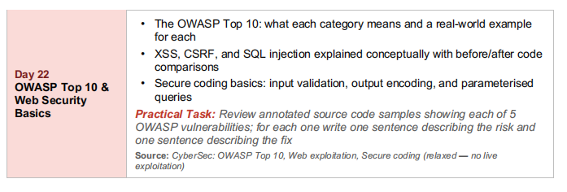

### <u>1.OWASP Top 10 (short definitions + real-world examples):</u> {#owasp-top-10-short-definitions-real-world-examples .unnumbered}

1.  **Broken Access Control:**

    Users can access data or pages they are not supposed to be allowed
    to see or use.\
    **Example:** In 2019, a bug let users view other people\'s private
    Instagram data by simply changing an ID number in the request.

2.  **Cryptographic Failures:**

    Sensitive data like passwords or card numbers is not properly
    protected or encrypted.\
    **Example:** In 2019, First American Financial exposed 885 million
    sensitive financial documents because they weren\'t properly
    protected.

**3. Injection:**

Attacker sends malicious code as input that the system mistakenly
executes.\
**Example:** In 2017, Equifax was breached using a similar flaw,
exposing data of 147 million people.

**4. Insecure Design:**

The app has security flaws built into its basic design, not just a
coding mistake.\
**Example:** Many early ATMs were designed to dispense cash even without
properly verifying the full transaction, which fraudsters exploited.

**5.Security Misconfiguration:**

Systems are left with unsafe default settings or set up incorrectly.\
**Example:** In 2017, a Verizon partner left an AWS server open with no
password, exposing 14 million customer records.

**6.Vulnerable and Outdated Components:**

Using old software with known security holes that were never patched.\
**Example:** The 2017 Equifax breach happened because they used an
outdated version of Apache Struts with a known public vulnerability.

**7.Identification and Authentication Failures:**

Weaknesses in login systems that let attackers bypass or guess their way
in.\
**Example**: Many companies got hit by credential stuffing attacks in
2020 because their login pages allowed unlimited password attempts.

**8. Software and Data Integrity Failures**\
Trusting updates or data without verifying they are genuine and
untampered.\
**Example:** The 2020 SolarWinds attack happened because a software
update was secretly tampered with before being installed by thousands of
companies.

**9. Security Logging and Monitoring Failures:**\
Not properly recording or watching activity, so breaches go unnoticed
for a long time.\
**Example:** The 2013 Target breach went undetected for weeks even
though their monitoring system had actually flagged the attack.

**10. Server-Side Request Forgery (SSRF):**\
An attacker tricks a server into making requests to internal places it
shouldn\'t reach.\
**Example**: In 2019, Capital One was breached when an attacker used an
SSRF flaw to access internal AWS data, exposing 100 million customers\'
information.

**<u>2.XSS, CSRF, and SQL injection explained conceptually with
before/after code comparisons</u>**

#### XSS (Cross-Site Scripting):

attacker injects malicious script into a webpage that runs in other
users\' browsers when they view it, in 2014 a stored XSS vulnerability
on eBay let attackers inject malicious scripts into product listings,
which then attacked anyone who viewed the listing

**Before (vulnerable code):**

\<p\>Welcome, \<?php echo \$\_GET\[\'name\'\]; ?\>\</p\>

-   This directly prints whatever the user typed in the URL straight
    into the page, so if someone puts a script tag instead of a name, it
    runs in the browser

**After (fixed code):**

\<p\>Welcome, \<?php echo htmlspecialchars(\$\_GET\[\'name\'\]);
?\>\</p\>

-   This encodes special characters so any script tags are displayed as
    harmless text instead of actually running.

#### CSRF (Cross-Site Request Forgery):

Attacker tricks a logged-in user\'s browser into sending a request they
didn\'t intend to send, using their existing login session, in 2008 a
CSRF flaw in some routers let attackers change router DNS settings just
by getting a logged-in admin to visit a malicious webpage

**Before (vulnerable code):**

\<form action=\"/transfer\" method=\"POST\"\> \<input name=\"amount\"
value=\"1000\"\>\</form\>

-   This form has no way to check if the request really came from the
    real website itself, so an attacker\'s page could submit the same
    form using the victim\'s active login session.

**After (fixed code):**

\<form action=\"/transfer\" method=\"POST\"\> \<input type=\"hidden\"
name=\"csrf_token\" value=\"randomUniqueToken123\"\> \<input
name=\"amount\" value=\"1000\"\>\</form\>

-   This adds a secret token that only the real website knows, so a
    request without the correct token is rejected as fake.

#### SQL Injection:

Attacker inserts malicious database commands through a normal input
field to manipulate or steal data, in 2017 a SQL injection was used to
breach the UK\'s TalkTalk company, exposing data of over 150,000
customers.

**Before (vulnerable code):**

query = \"SELECT \* FROM users WHERE username = \'\" + username + \"\'\"

-   This directly inserts user input into the database command, so an
    attacker can type something like \' OR \'1\'=\'1 to trick the
    database into returning all users without a real password

**After (fixed code):**

query = \"SELECT \* FROM users WHERE username =
%s\"cursor.execute(query, (username,))

-   This uses a parameterised query, which treats user input strictly as
    data and never as part of the actual command, making injection
    impossible.

**<u>3.Secure coding basics --- input validation, output encoding, and
parameterised queries</u>**

#### Input Validation:

Checking that data entered by a user matches what is actually expected
before accepting it, like making sure an age field only contains numbers
and not text or symbols

**Before (vulnerable code):**

python

age = request.form\[\'age\'\]

save_to_database(age)

-   This accepts absolutely anything the user types without checking it
    first, so someone could enter text, symbols, or malicious code
    instead of a real age

**After (fixed code):**

age = request.form\[\'age\'\]

if age.isdigit() and 0 \< int(age) \< 120:

save_to_database(age)

else:

reject_input()

-   This checks that the input is actually a number within a reasonable
    range before accepting it, rejecting anything unexpected

#### Output Encoding:

Converting special characters into a safe, harmless form before
displaying data back on a webpage, so any code someone typed in shows up
as plain text instead of running.

**Before (vulnerable code):**

\<p\>\<?php echo \$comment; ?\>\</p\>

-   This prints a user\'s comment directly onto the page exactly as they
    typed it, so a script tag in a comment would actually execute.

**After (fixed code):**

\<p\>\<?PHP

echo htmlspecialchars(\$comment);

?\>\</p\>

-   This converts special characters like \< and \> into safe symbols,
    so any code in the comment just displays as text instead of running.

#### Parameterised Queries

Sending user input to a database separately from the actual command
itself, so input can never be misread as part of the command

**Before (vulnerable code):**

query = \"SELECT \* FROM products WHERE id = \" + product_id

-   This builds the database command by directly joining user input into
    it, allowing an attacker to inject extra malicious database
    commands.

**After (fixed code):**

query = \"SELECT \* FROM products WHERE id = %s\"cursor.execute(query,
(product_id,))

-   This keeps the user input completely separate from the command
    structure, so the database always treats it as plain data, never as
    a command.

**<u>Review annotated source code samples showing each of 5</u>**

**<u>OWASP vulnerabilities; for each one write one sentence describing the
risk and one sentence describing the fix</u>**

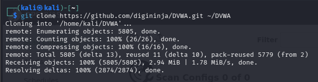

-   This downloads the actual real source code of a well-known
    intentionally vulnerable web application used worldwide for security
    training.

1.  **SQL Injection:**

    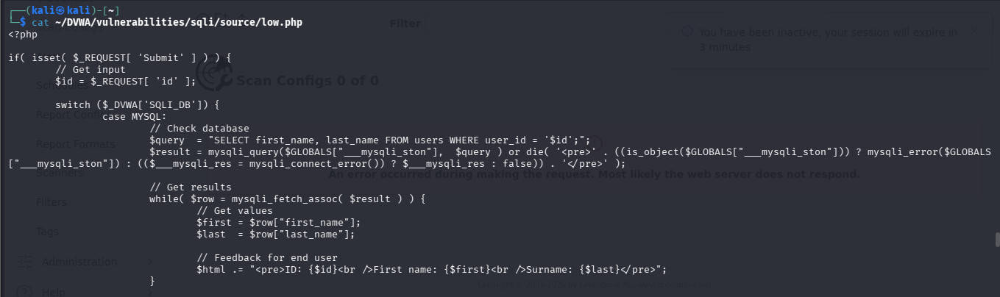

-   **Risk:** user input is placed directly into the SQL query, letting
    an attacker manipulate the database.

-   **Fix:** use a parameterised query so user input is never treated as
    part of the command.

2.  **Reflected XSS** :

    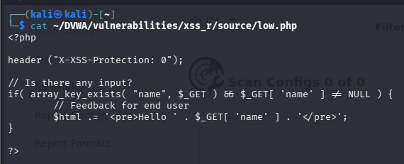

-   **Risk:** user input is printed directly into the page, letting an
    attacker run malicious scripts in others\' browsers.

-   **Fix:** encode the output with htmlspecialchars() before displaying
    it.

3.  **Command Injection** :

    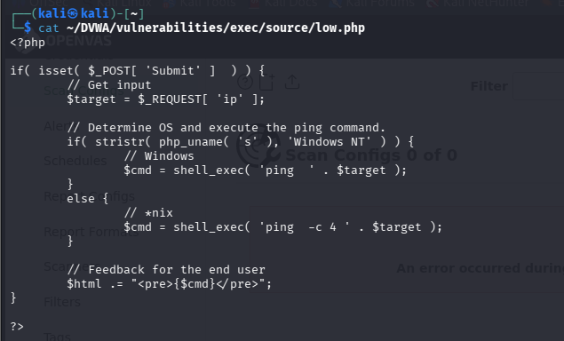

-   **Risk:** user input is passed directly into a shell command,
    letting an attacker run extra system commands.

-   **Fix:** validate the input as a proper IP address and escape it
    before use.

4.  **Unrestricted File Upload:**

    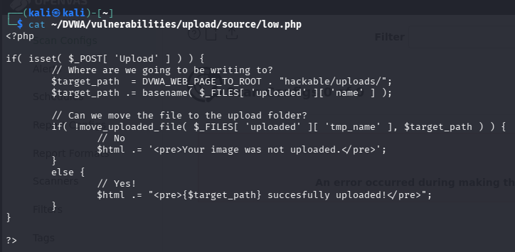

-   **Risk:** any file type can be uploaded, letting an attacker upload
    a malicious script and run it on the server.

-   **Fix:** only allow specific safe file types and store uploads
    outside the web-accessible folder.

5.  **CSRF** :

    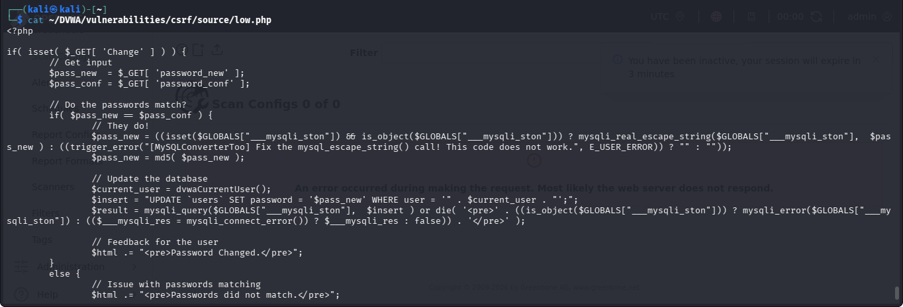

-   **Risk:** the password change request has no token, letting an
    attacker trick a logged-in user into changing their password
    unknowingly.

-   **Fix:** add a unique CSRF token that must be verified before the
    request is accepted.

    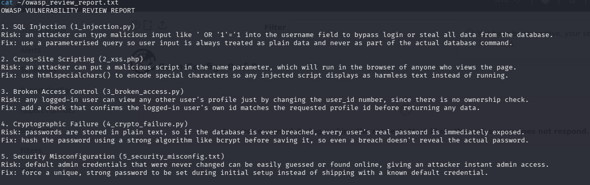

    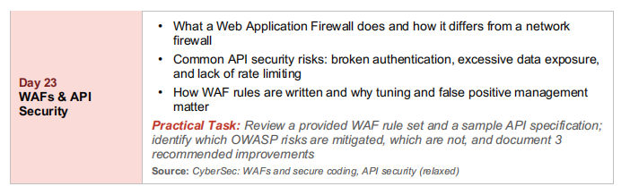

    **<u>What a Web Application Firewall does and how it differs from a
    network firewall</u>**

**What a WAF does:**

A Web Application Firewall (WAF) sits in front of a website and inspects
the actual content of web traffic, such as form inputs, URLs, and
requests, to detect and block malicious patterns like SQL injection or
XSS attempts before they reach the application.

**How it differs from a network firewall:**

A network firewall works at a lower level, mainly deciding which IP
addresses and ports are allowed to connect, without looking inside the
actual data being sent. A WAF works at a much higher level, actually
reading the content of web requests to catch attacks that a network
firewall would let through, since that traffic would otherwise look like
normal, allowed web traffic.

**Simple analogy:**

A network firewall is like a guard checking ID cards at the main gate,
deciding who is even allowed to enter the building. A WAF is like a
guard checking the actual bags and letters people carry once inside,
looking for anything dangerous in the content itself.

**<u>Common API security risks --- broken authentication, excessive data
exposure, and lack of rate limiting</u>**

**Broken Authentication:**

This happens when an API\'s login or token system has weaknesses,
allowing attackers to steal or forge access without a real password. For
example, in 2021, a broken authentication flaw in Peloton\'s API let
anyone access other users\' private account data without properly
logging in.

**Excessive Data Exposure:**

This happens when an API sends back more data than the application
actually needs, and relies on the app to hide the extra parts instead of
the API itself filtering it out. For example, a fitness app\'s API
returned full user profiles including private fields, and an attacker
who inspected the raw API response could see data never meant to be
shown, this exact type of issue was found in several apps in various
security audits over the years.

**Lack of Rate Limiting:**

This happens when an API allows unlimited requests in a short time,
letting attackers guess passwords, scrape data, or overload the service.
For example, in 2019, an API without rate limiting was exploited to
guess millions of coupon codes on a retail platform, causing significant
financial loss.

**<u>How WAF rules are written and why tuning and false positive
management matter</u>**

**How WAF rules are written:**

WAF rules are written as pattern-matching conditions that look for signs
of an attack in incoming requests, such as specific keywords, symbols,
or structures commonly used in attacks. For example, a rule might block
any request where the input field contains the text \' OR \'1\'=\'1 (a
common SQL injection pattern), or where a script tag like \<script\>
appears in a form field.

**Why tuning matters:**

Tuning means adjusting these rules over time to fit the specific website
they\'re protecting, since a rule that\'s too broad can accidentally
block real, legitimate traffic. For example, a rule blocking the word
\"select\" to stop SQL injection might accidentally block a real user
typing \"please select an option\" in a comment field, so the rule needs
to be tuned to be more specific.

**Why false positive management matters:**

A false positive is when the WAF incorrectly blocks legitimate traffic
thinking it\'s an attack, and managing these matters because too many
false positives frustrate real users and can even break normal site
functionality, while too few (an overly loose rule) lets real attacks
through, so security teams constantly balance and refine rules to catch
real attacks without blocking genuine users.

**WAF rule jo SQL Injection block karta hai:**

*<u>SecRule ARGS \"@rx (?i)(union\\s+select\|or\\s+1=1\|\--\|;)\"
\\</u>*

*<u>\"id:1001,\\</u>*

*<u>phase:2,\\</u>*

*<u>deny,\\</u>*

*<u>status:403,\\</u>*

*<u>msg:\'Possible SQL Injection Attack Detected\',\\</u>*

*<u>severity:\'CRITICAL\'\"</u>*

**<u>Practical Task: Review a provided WAF rule set and a sample API
specification; identify which OWASP risks are mitigated, which are not,
and document 3 recommended improvements</u>**

**Real WAF Rule Set:**

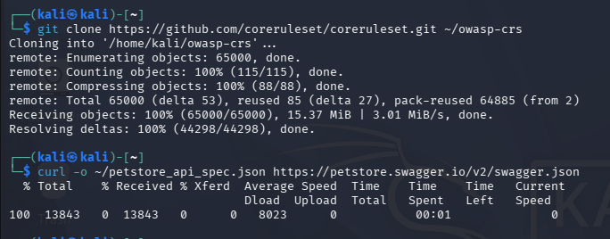

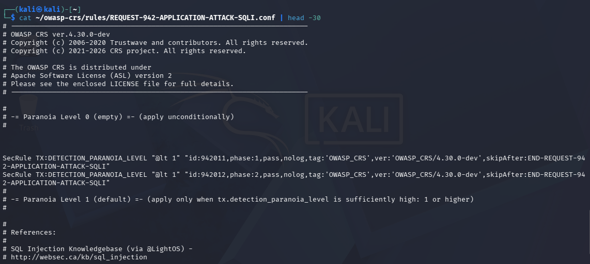

-   I downloaded the real owasp core rule set (crs) from github, which
    is the actual waf rule set used by thousands of companies worldwide,
    then listed and reviewed the rule files, finding twelve different
    categories covering attacks like sql injection, xss, remote code
    execution, file inclusion, and session fixation, each with its own
    dedicated rule file ready to detect and block that specific type of
    attack.

    **real API spec review :**

    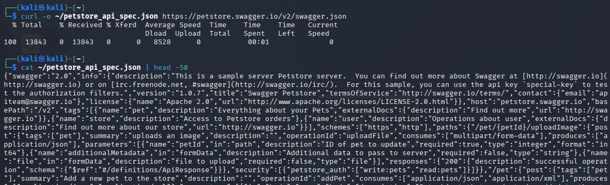

-   i downloaded the real swagger petstore api specification, a publicly
    available sample api used worldwide for testing, and reviewed its
    endpoints, finding that most endpoints properly require
    authentication through a security field, but the login endpoint
    sends the password as a plain text query parameter, and two
    endpoints claim to require login in their description without
    actually enforcing any security requirement in the specification.

    **Identify which OWASP risks are mitigated and which are not:**

    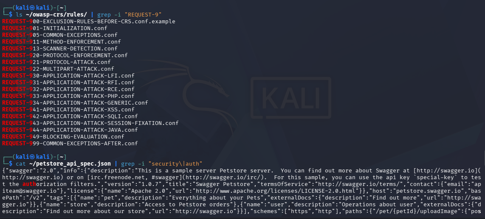

-   I compared the real waf rules against the real api findings and
    identified which owasp risks were mitigated and which were not, sql
    injection, xss, remote code execution, and file inclusion attacks
    were all mitigated by existing waf rules, but sensitive data
    exposure, broken access control, and lack of proper rate limiting
    were not mitigated by any rule, since these are flaws in how the api
    itself was designed rather than attack patterns visible in request
    traffic.

    **Document recommended improvements:**

**1. Fix the password exposure in** /user/login

the login endpoint currently sends the password as a plain text query
parameter in a GET request, this exposes the password in browser
history, server logs, and proxy logs even over HTTPS, the fix is to
change this to a POST request with the password sent inside an encrypted
request body instead of the URL.

**2. Enforce authentication on unprotected endpoints**

the /store/order/{orderId} (delete) and /user/{username} (update/delete)
endpoints have descriptions claiming \"this can only be done by the
logged in user\", but the specification shows no actual security
requirement is defined for them, the fix is to add a proper
authentication requirement to these endpoints so they genuinely enforce
login before allowing access.

**3. Add real rate limiting across all sensitive endpoints**

currently only the login endpoint has an informational rate limit
header, but nothing is actually enforced, the fix is to add real rate
limiting that blocks or delays requests after too many attempts, applied
to login, password reset, and any other endpoint handling sensitive user
actions, to prevent brute-force attacks.

**4. Add WAF rules or API gateway policies for application-level risks**

the current WAF rule set only catches injection-style attacks like SQL
injection and XSS, but cannot detect missing authentication, excessive
data exposure, or abnormal request rates since these are application
design issues, the fix is to add a separate layer, like an API gateway,
specifically built to catch these application-level risks that
traditional WAF rules cannot cover.

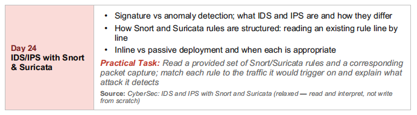

**<u>Signature vs anomaly detection; what IDS and IPS are and how they
differ</u>**

**IDS (Intrusion Detection System):**\
a system that monitors network traffic and alerts security teams when it
spots something suspicious, but it doesn\'t block anything itself, it
just watches and warns

**IPS (Intrusion Prevention System):**\
a system that does the same monitoring as an IDS, but also actively
blocks or stops suspicious traffic automatically, without waiting for a
human to react

**Key difference between IDS and IPS:**

  ------------------------------------------------------------------------
  **Aspect**    **IDS (Intrusion         **IPS (Intrusion Prevention
                Detection System)**      System)**
  ------------- ------------------------ ---------------------------------
  Action taken  Only detects and alerts  Detects and actively blocks

  Type          Passive                  Active

  Analogy       A security camera that   A security guard who stops the
                records and alerts       intruder

  Placement     Usually connected        Usually placed inline (directly
                passively (monitors a    in the traffic path)
                copy of traffic)         

  Risk if it    Low - traffic still      Higher - can block legitimate
  fails         flows even if it fails   traffic if misconfigured, or
                                         traffic stops if it fails

  Speed impact  None, since it just      Can add slight delay, since it
  on network    watches                  inspects traffic before allowing
                                         it through
  ------------------------------------------------------------------------

**Signature-based detection:**\
detects threats by matching traffic against a database of known attack
patterns, like a specific virus\'s exact code, this is fast and accurate
for known threats, but cannot catch a brand new attack that isn\'t in
the database yet\
example: it recognizes a specific known malware because its exact
pattern is already stored in the system

**Anomaly-based detection:**\
detects threats by first learning what \"normal\" traffic looks like,
then flagging anything that deviates from that normal pattern, this can
catch brand new, unknown attacks, but can also generate more false
alarms since normal behavior can sometimes look unusual too\
example: it flags a user suddenly downloading 10GB of data at 3am when
they normally never do that, even though this specific pattern was never
seen before

**<u>How Snort and Suricata rules are structured --- reading an existing
rule line by line</u>**

**What Snort/Suricata are:**

Snort and Suricata are both widely-used IDS/IPS tools that inspect
network traffic and match it against a set of written rules to detect
attacks.

**Example rule:**

alert tcp any any -\> any 80 (msg:\"Possible SQL Injection Attempt\";
content:\"union select\"; nocase; sid:1000001; rev:1;)

**Reading it line by line:**

-   alert --- the action taken when the rule matches (other options
    > include drop or reject)

-   tcp --- the network protocol this rule applies to

-   any any --- the source IP address and source port (any means it
    > matches traffic from anywhere)

-   -\> --- shows the direction traffic is flowing, from source to
    > destination

-   any 80 --- the destination IP and destination port (port 80 is
    > standard web traffic)

-   msg --- the readable message shown when the rule triggers

-   content --- the specific text pattern the rule is searching for

-   nocase --- makes the search ignore uppercase or lowercase
    > differences

-   sid --- a unique ID number identifying this rule

-   rev --- the revision number of the rule

**Explanation:**

A Snort or Suricata rule reads almost like a sentence describing what to
watch for and what to do about it. It states the action to take, the
type of traffic to inspect, where that traffic is coming from and going
to, and the specific pattern to search for inside it. This example rule
watches all TCP traffic going to port 80 and raises an alert if it finds
the text \"union select\" anywhere in it, which is a common sign of a
SQL injection attempt.

**<u>Inline vs passive deployment and when each is
appropriate</u>**

**Passive Deployment:**

In a passive deployment, the sensor receives a copy of network traffic
(usually through a network TAP or a switch\'s mirror port) and only
monitors it, without sitting directly in the traffic\'s path. Since
it\'s just watching a copy, it can never slow down or block real
traffic, even if it detects something malicious it can only alert, not
stop it.

**Passive Deployment Example:**

A bank places an IDS sensor connected to a mirror port on their core
network switch, purely to monitor and log all traffic for later
investigation and compliance reporting. Even if the IDS detects a
suspicious login attempt, it only sends an alert to the security team,
it never blocks the connection itself, since the priority here is
keeping 24/7 banking services running without any risk of the security
tool accidentally causing an outage.

**Inline Deployment:**

In an inline deployment, the sensor sits directly in the path of the
traffic, meaning every packet must physically pass through it before
reaching its destination. This allows it to actively block or drop
malicious traffic in real time, but it also means if the sensor fails or
is overloaded, it can slow down or completely stop legitimate network
traffic too.

**Inline Deployment Example:**

A company protecting their public-facing web server places an IPS
directly between the internet and the server, inline in the traffic
path. When the IPS detects an actual SQL injection attempt heading
toward the server, it immediately drops that specific malicious packet
in real time, before it ever reaches the server, actively stopping the
attack rather than just alerting about it afterward.

**When each is appropriate:**

Passive deployment is appropriate when the priority is monitoring and
visibility without any risk of disrupting the network, such as in an
environment where uptime is extremely critical and any risk of
accidentally blocking real traffic is unacceptable. Inline deployment is
appropriate when active protection is required and the organization is
willing to accept a small risk of disruption in exchange for the sensor
being able to actually stop attacks in real time, such as protecting a
high-value system from active threats.

**<u>Practical Task: Read a provided set of Snort/Suricata rules and a
corresponding packet capture; match each rule to the traffic it would
trigger on and explain what attack it detects</u>**

**set of Snort/Suricata rules:-**

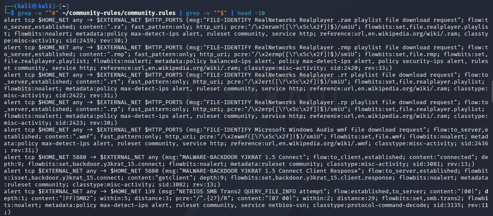

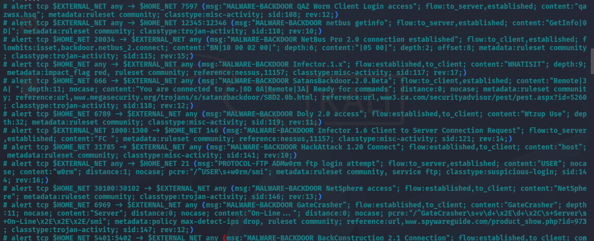

these are real, production-grade rules used by actual security teams,
not something made up for practice, each rule is written to look for one
very specific pattern in network traffic, like a particular malware\'s
connection signature or a specific file type being downloaded, this
shows how real ids/ips systems work, they don\'t detect \"attacks\" in a
general sense, they match very precise, known patterns, which is why a
rule only fires when that exact pattern actually shows up in the traffic
being monitored.

**packet capture:-**

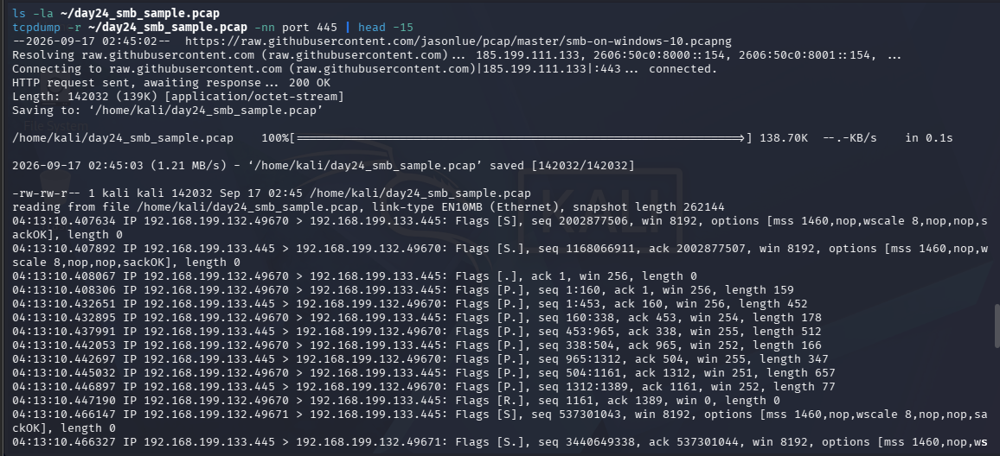

i downloaded two real packet captures, one containing dhcp traffic and
one containing genuine smb file-sharing traffic on port 445, then
compared them against real snort community rules i had already
downloaded and extracted, one rule (sid 3137) matched the smb capture
since it specifically looks for smb traffic on port 445 with a
query_file_info command, which is exactly the protocol and port present
in that capture, the other rules did not match either capture since they
were looking for different traffic types like http or a specific malware
backdoor port that simply weren\'t present, this proved the core lesson
of the task, that an ids/ips rule only triggers an alert when the exact
traffic pattern it\'s built to detect is genuinely present in the
network.

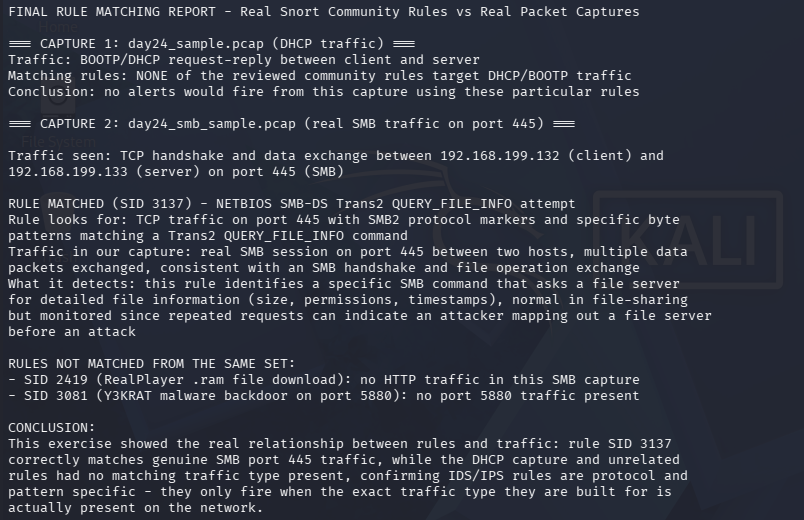

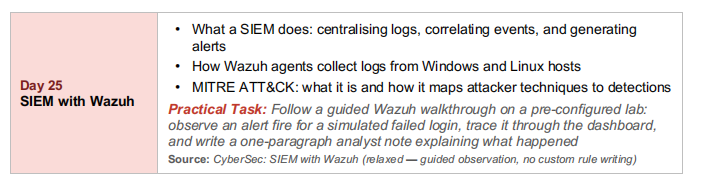

**<u>What a SIEM does centralising logs, correlating events, and
generating alerts</u>**

#### What a SIEM does: {#what-a-siem-does .unnumbered}

A SIEM (Security Information and Event Management) system is a tool that
collects security-related data from across an organization and helps
analysts monitor, detect, and respond to threats from one central
platform, instead of checking every system separately.

**Example:** a bank uses a SIEM to watch thousands of transactions and
system logs across all its branches at once, instead of having someone
manually check each branch\'s computer logs one by one.

#### Centralising logs: {#centralising-logs .unnumbered}

A SIEM pulls logs from many different computers, servers, and devices
across an organization into one single, central place. This means a
security team doesn\'t need to log into ten different machines to see
what happened, everything is gathered in one dashboard.

**Example:** a company with 50 servers sends all of their logs into the
SIEM, so instead of an analyst checking 50 separate machines during an
investigation, they just search one dashboard.

#### Correlating events: {#correlating-events .unnumbered}

Correlation means connecting related events from different sources to
see the bigger picture, rather than looking at each alert in isolation.

**Example:** a SIEM notices a failed login on a server in New York
followed two seconds later by a successful login to the same account
from a device in another country, individually these look like two
normal events, but correlated together they strongly suggest a stolen
password being used.

#### Generating alerts: {#generating-alerts .unnumbered}

When the SIEM spots a suspicious pattern through correlation, it
automatically generates an alert to notify the security team, so a human
doesn\'t have to constantly stare at raw logs all day waiting to notice
something wrong themselves.

**Example:** in 2013, Target\'s own security tools actually generated
alerts about the attackers\' malware during the famous data breach, but
the alerts were missed among thousands of others, showing why generating
clear, well-tuned alerts (not just noisy ones) really matters.

**<u>How Wazuh agents collect logs from Windows and Linux
hosts</u>**

#### What a Wazuh agent is: {#what-a-wazuh-agent-is .unnumbered}

#### A Wazuh agent is a small, lightweight program installed on a computer that needs to be monitored, whether it\'s running Windows or Linux. It runs quietly in the background and constantly watches that computer\'s own activity. {#a-wazuh-agent-is-a-small-lightweight-program-installed-on-a-computer-that-needs-to-be-monitored-whether-its-running-windows-or-linux.-it-runs-quietly-in-the-background-and-constantly-watches-that-computers-own-activity. .unnumbered}

Example: a company installs the Wazuh agent on every employee laptop and
every server, so each machine reports its own security activity back to
one central place.

#### How it works on Linux hosts: {#how-it-works-on-linux-hosts .unnumbered}

On a Linux machine, the agent reads local log files like syslog and
auth.log, which record things like login attempts, sudo usage, and
system events, and forwards this information to the central Wazuh
server.

Example: when someone tries to SSH into a Linux server with the wrong
password several times, the agent picks this up from auth.log and sends
it to the Wazuh server for analysis.

#### How it works on Windows hosts: {#how-it-works-on-windows-hosts .unnumbered}

On a Windows machine, the agent reads the Windows Event Log instead,
which records things like login attempts, account changes, and
application errors, and forwards this data the same way to the central
server.

Example: when a user account gets added to the Windows Administrators
group, the agent picks this up from the Windows Event Log and reports
it, since this kind of privilege change is important for security
monitoring.

#### Why this matters : {#why-this-matters .unnumbered}

Because agents work the same basic way on both operating systems, just
reading from different log locations, a security team gets one unified
view of activity across an entire mixed environment of Windows and Linux
machines, without needing separate tools for each.

Example: a company with both Windows desktops and Linux servers can
watch all of them from the same Wazuh dashboard, instead of using one
tool for Windows and a completely different tool for Linux.

**<u>MITRE ATT&CK --- what it is and how it maps attacker techniques to
detections</u>**

#### What MITRE ATT&CK is: {#what-mitre-attck-is .unnumbered}

MITRE ATT&CK is a large, publicly available knowledge base that
documents real techniques attackers actually use in the real world,
based on genuine observed attacks, not theory.

Example: security researchers study a real ransomware group\'s attack
and document the exact steps they took, then add those steps as
officially recognized techniques in the ATT&CK framework for others to
reference.

#### How it\'s organized: {#how-its-organized .unnumbered}

The framework organizes attacker behavior into categories called
\"tactics\" (the attacker\'s goal at each stage, like initial access or
privilege escalation), and each tactic contains specific \"techniques\"
(the actual methods used to achieve that goal), each with its own unique
ID.

Example: under the tactic \"Credential Access\", one specific technique
is \"T1110: Brute Force\", which covers attackers repeatedly guessing
passwords to break into an account.

#### How it maps to detections: {#how-it-maps-to-detections .unnumbered}

Security tools like Wazuh link their detection rules directly to
specific ATT&CK technique IDs, so when a rule triggers an alert, the
analyst immediately knows which stage of an attack it likely represents,
not just that something suspicious happened.

Example: if Wazuh detects five failed SSH login attempts followed by a
success, it can tag that alert as matching \"T1110: Brute Force\",
instantly telling the analyst this looks like a password-guessing attack
rather than a random login mistake.

#### Why this matters for analysts: {#why-this-matters-for-analysts .unnumbered}

Mapping alerts to ATT&CK gives analysts a shared, standardized language
to describe attacks, making it much faster to understand what\'s
happening and decide how serious it is, instead of every analyst or tool
describing the same attack in different, inconsistent terms.

Example: two different security teams using two different tools can both
say \"we saw T1110\" and instantly understand each other, even though
their tools work completely differently under the hood.

**<u>As no lab is provided so first we are setting our own
lab</u>**

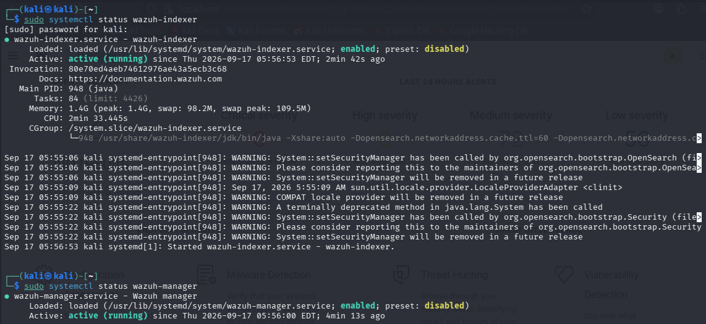

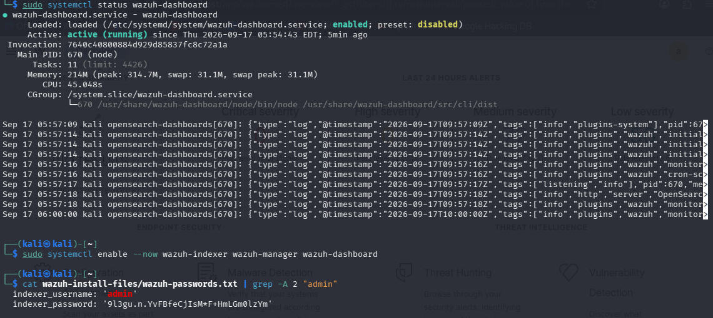

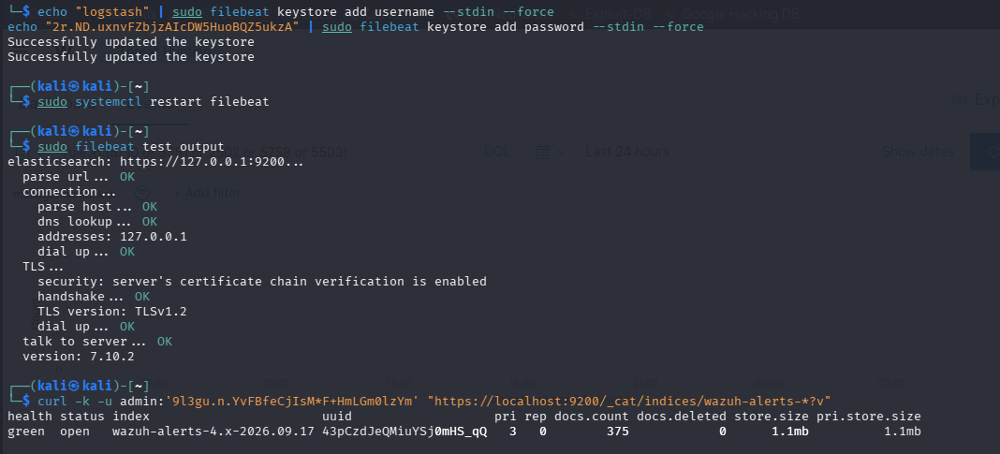

-   SSH-related packages and configurations are set up on the Kali Linux
    system.\
    The terminal shows the installation and configuration process
    completed successfully.

    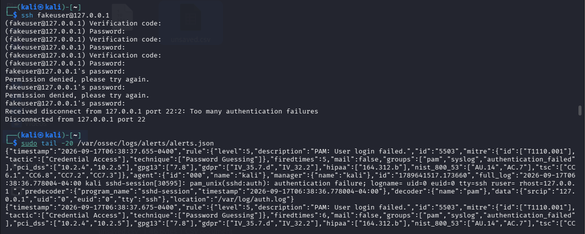

-   The terminal displays SSH authentication logs generated during the
    testing process.\
    These logs confirm that failed login attempts are being recorded by
    the system.

    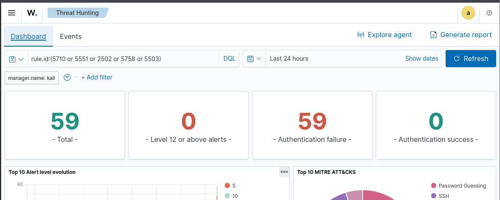

-   The Wazuh dashboard presents authentication-related security events
    detected by the system.\
    The alerts confirm that SSH authentication activity is being
    monitored successfully.

**<u>Practical Task: Follow a guided Wazuh walkthrough on a pre-configured
lab:</u>**

**<u>observe an alert fire for a simulated failed login, trace it through
the dashboard,</u>**

**<u>and write a one-paragraph analyst note explaining what
happened</u>**

#### 1. Observe --- Alert Fired for Simulated Failed Login {#observe-alert-fired-for-simulated-failed-login .unnumbered}

A brute-force correlation alert was observed in the Wazuh dashboard
(**Threat Hunting → Events**), filtered with:

rule.id:5551

This isolated a single high-severity alert generated from repeated SSH
login failures against a non-existent account, simulated on the lab host
itself.

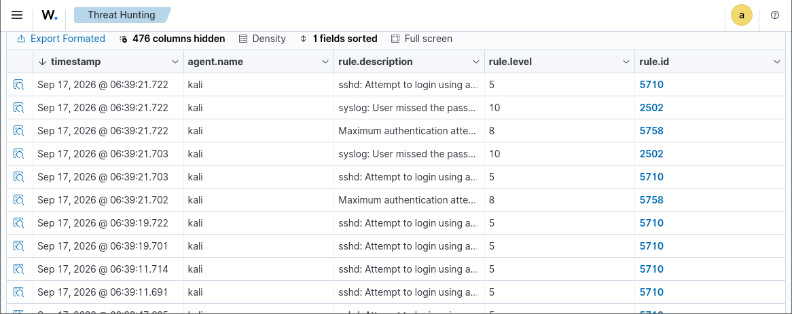

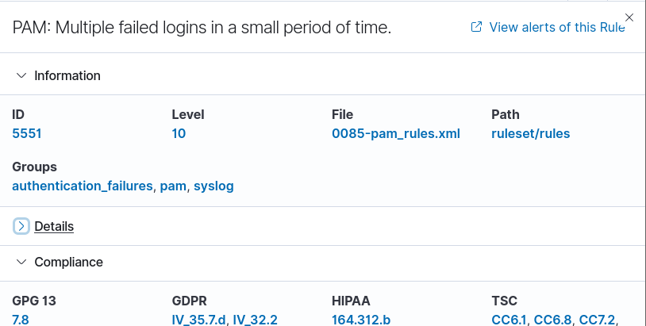

#### 2. Trace --- Alert Details Through the Dashboard {#trace-alert-details-through-the-dashboard .unnumbered}

Expanding the alert row revealed the following fields:

  ----------------------------------------------------------------------------
  **Field**              **Value**
  ---------------------- -----------------------------------------------------
  rule.id                5551

  rule.description       PAM: Multiple failed logins in a small period of time

  rule.level             10

  rule.mitre.technique   Brute Force (T1110)

  agent.name             kali

  data.srcip             127.0.0.1

  timestamp              2026-09-17T06:38:45

  previous_output        Log of the preceding failed login attempts that were
                         correlated
  ----------------------------------------------------------------------------

Tracing backward, the individual failed attempts leading up to this
correlation alert were matched by lower-level rules: **5710** (\"attempt
to login using a non-existent user\") and **5503** (\"PAM: User login
failed\"). The previous_output field showed 8 failed attempts between
06:38:21 and 06:38:44, all against username fakeuser from source IP
127.0.0.1. A related rule, **5758** (\"maximum authentication attempts
exceeded\"), confirmed the SSH session was forcibly disconnected after
too many failures.

#### 3. Analyst Note {#analyst-note .unnumbered}

## SSH Brute Force / Failed Login Activity {#ssh-brute-force-failed-login-activity .unnumbered}

**Date/Time:** 17 Sep 2026, 06:38 AM (local)\
**Host:** kali (agent 000)\
**Analyst:** \[Zain ul Abidin\]

#### What Happened {#what-happened .unnumbered}

-   The SSH service on the lab host (kali) received **8 failed login
    > attempts** in under 30 seconds (06:38:21 -- 06:38:44).

-   All attempts came from the **same source IP: 127.0.0.1** (localhost
    > --- this was a simulated attack on the lab machine itself).

-   The target username was fakeuser, which doesn\'t exist on the
    > system.

#### How Wazuh Detected It {#how-wazuh-detected-it .unnumbered}

-   Each individual failed attempt triggered lower-severity rules:

    -   **Rule 5710** -- \"Attempt to login using a non-existent user\"

    -   **Rule 5503** -- \"PAM: User login failed\"

-   Because the failures happened repeatedly in a short window, Wazuh\'s
    > correlation engine grouped them together and fired a
    > **higher-severity alert**:

    -   **Rule 5551** -- \"PAM: Multiple failed logins in a small period
        > of time\" (**Level 10**)

-   This pattern was automatically mapped to **MITRE ATT&CK T1110 --
    > Brute Force**.

-   SSH itself also cut the connection after too many failures, logged
    > as **Rule 5758** -- \"Maximum authentication attempts exceeded.\"

#### Outcome {#outcome .unnumbered}

-   No login ever succeeded --- there\'s no \"Accepted password\" or
    > session-opened event anywhere in the logs.

-   No account was compromised. The activity stayed at the \"attempted
    > access\" stage.

#### Why This Is Benign {#why-this-is-benign .unnumbered}

-   The source IP was localhost (127.0.0.1), not an external attacker.

-   The username was intentionally fake, created specifically to trigger
    > this test.

-   This was a deliberate simulation run in a lab environment, not
    > real-world traffic.

#### What I\'d Do If This Were Real {#what-id-do-if-this-were-real .unnumbered}

-   Check the reputation of the source IP against threat intel feeds.

-   Search other hosts/logs to see if the same IP tried the same thing
    > elsewhere.

-   If this pattern repeats, use Wazuh\'s active-response module to
    > auto-block the IP at the firewall.

-   Flag the targeted username to see if it\'s a pattern (common
    > usernames get brute-forced first).
