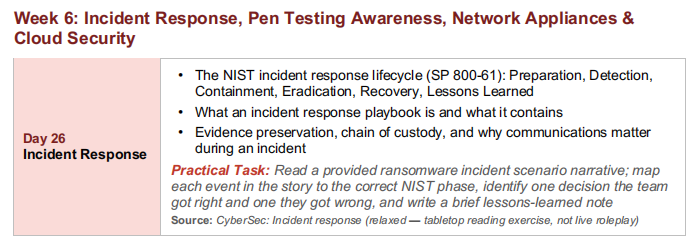
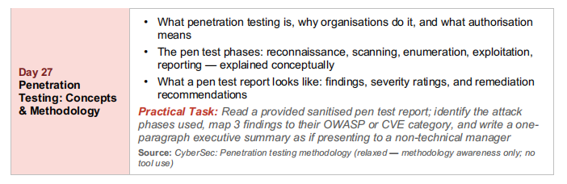
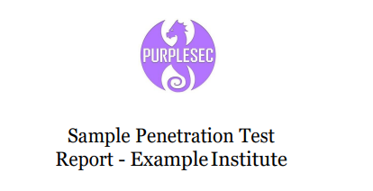
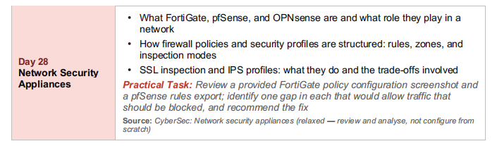
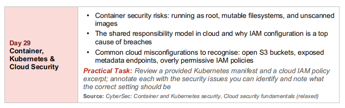
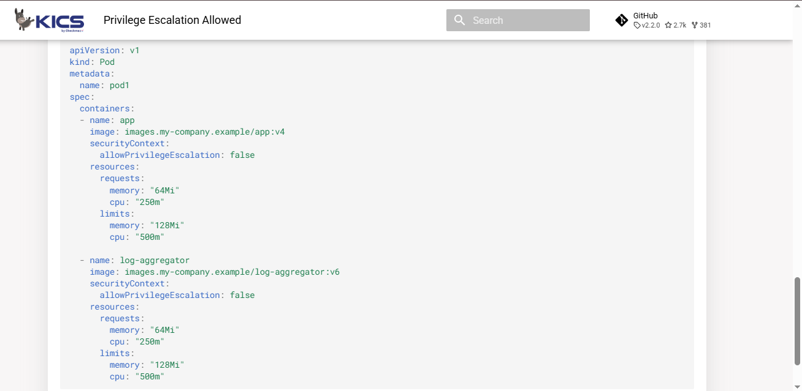
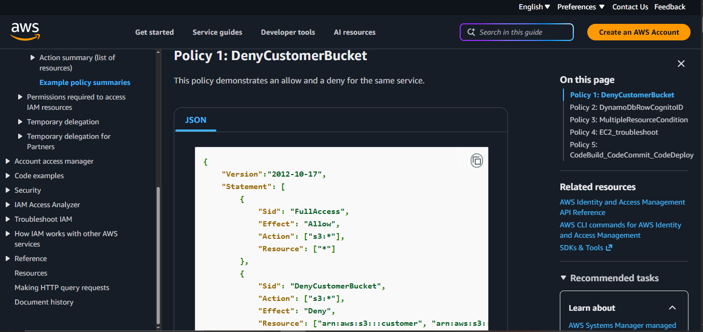
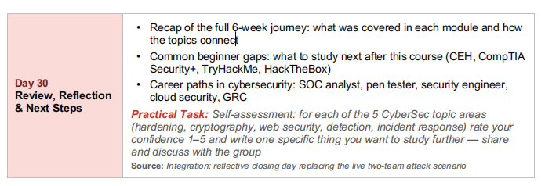

**<u>The NIST incident response lifecycle (SP 800-61) Preparation,
Detection, Containment, Eradication, Recovery, Lessons
Learned</u>**

#### NIST Incident Response Lifecycle (SP 800-61) :-

NIST SP 800-61 is an official publication by the National Institute of
Standards and Technology (a US government agency) that provides a
standardized guide for how organizations should handle security
incidents, from getting ready beforehand all the way through to
reviewing what happened afterward. It breaks the entire process into six
clear phases, giving security teams a common, structured approach to
follow instead of reacting randomly during a crisis.

#### Preparation:-

Preparation means getting ready before an incident even happens, by
having tools, trained staff, and a clear plan already in place.

**Example:** a company keeps an up-to-date contact list of who to call
during a breach, and makes sure backups are tested regularly, before any
incident occurs.

#### Detection:-

Detection is the stage where the team actually notices that something
suspicious or malicious is happening.

**Example:** a SIEM alert fires showing an unusual login from a foreign
country at 3am, and the security team recognizes it as a possible
compromise.

#### Containment:-

Containment means stopping the incident from spreading further while
it\'s still being dealt with, without necessarily fixing everything yet.

**Example:** the team disconnects an infected laptop from the network
immediately, so ransomware can\'t spread to other machines, even before
they know exactly how it got in.

#### Eradication:-

Eradication means actually removing the root cause of the incident, not
just isolating it.

**Example:** the team finds and deletes the malware, closes the
vulnerability that let the attacker in, and resets any compromised
passwords.

#### Recovery:-

Recovery means safely bringing affected systems back to normal
operation, making sure they\'re clean before doing so.

**Example:** the team restores the affected server from a clean backup
and closely monitors it for a while to make sure the threat is truly
gone before fully trusting it again.

#### Lessons Learned:-

Lessons Learned is a review done after the incident is fully resolved,
to understand what happened and improve for next time.

**Example:** after a breach, the team holds a meeting to discuss what
went well, what went wrong, and updates their incident response plan
based on what they found.

**<u>What an incident response playbook is and what it
contains</u>**

#### What an incident response playbook is :-

An incident response playbook is a detailed, step-by-step document that
tells a security team exactly what to do when a specific type of
incident happens, so they don\'t have to figure things out from scratch
under pressure during a real crisis.

**Example:** a company has a separate playbook specifically for
\"ransomware incidents\" and another one for \"phishing incidents\",
since the exact steps needed differ for each type of attack.

#### Roles and responsibilities:-

A playbook clearly defines who is responsible for what during an
incident, so there\'s no confusion about who should be doing which task.

**Example:** the playbook states that the IT manager isolates infected
machines, the communications lead handles customer notifications, and
the security analyst investigates the root cause, all working in
parallel instead of stepping on each other.

#### Step-by-step response actions:-

The playbook lists the exact actions to take, usually mapped to the NIST
lifecycle phases (detection, containment, eradication, etc.), often in a
checklist format.

**Example:** for a ransomware playbook, step 3 might say \"immediately
disconnect the affected machine from the network\" and step 4 might say
\"identify the ransomware variant using its ransom note or file
extension.\"

#### Communication procedures:-

A playbook includes who needs to be informed, when, and how, both inside
and outside the organization.

**Example:** the playbook specifies that legal and executive leadership
must be notified within one hour of confirming a breach, and includes
pre-written templates for customer notification emails if data was
exposed.

#### Escalation criteria:-

A playbook defines the specific conditions under which an incident needs
to be escalated to a higher level, like senior management or external
authorities.

**Example:** the playbook states that if more than 100 customer records
are confirmed exposed, the incident must be escalated to the CEO and
legal team immediately, and may require reporting to a regulator.

**<u>Evidence preservation, chain of custody, and why communications
matter during an incident</u>**

#### Evidence preservation:-

Evidence preservation means carefully collecting and protecting any
digital evidence related to an incident (like logs, disk images, or
memory dumps) in a way that keeps it unchanged and usable for
investigation or legal purposes later.

**Example:** instead of just deleting a suspicious file, the team makes
an exact copy of the infected server\'s hard drive before doing anything
else, preserving the original evidence in case it\'s needed for a police
investigation or lawsuit.

#### Chain of custody:-

Chain of custody is a documented record that tracks exactly who handled
a piece of evidence, when, and what they did with it, from the moment it
was collected until it\'s no longer needed.

**Example:** a log file is copied from a server at 2:15pm by Analyst A,
who signs a form noting this, then hands it to Analyst B for review at
3:00pm, who also signs, creating an unbroken paper trail proving the
evidence wasn\'t tampered with along the way.

#### Why chain of custody matters:-

If evidence is ever needed in court or for a formal investigation, a
broken or missing chain of custody can make that evidence legally
questionable or even completely unusable, since anyone could claim it
was altered.

**Example:** a company identifies the exact attacker using recovered log
files, but because nobody documented who accessed those files after
collection, a defense lawyer successfully argues the evidence can\'t be
trusted, and the case falls apart.

#### Why communications matter during an incident:-

Clear, timely communication (both internal and external) during an
incident prevents confusion, panic, and misinformation, and can be
legally required in some cases (like notifying affected customers of a
data breach).

**Example:** during a breach, the company sends a clear internal update
to all employees every few hours explaining what\'s known and what\'s
not, preventing rumors and panic, while also preparing an honest, timely
public statement instead of staying silent, which regulators and
customers both expect.

**<u>Practical Task: Read a provided ransomware incident scenario
narrative; map each event in the story to the correct NIST phase,
identify one decision the team</u>**

**<u>got right and one they got wrong, and write a brief lessons-learned
note</u>**

### Real Incident: WannaCry Ransomware Attack (May 2017, NHS UK) {#real-incident-wannacry-ransomware-attack-may-2017-nhs-uk .unnumbered}

#### Real Timeline of Events:-

Back in March 2017, Microsoft actually released a patch fixing the exact
flaw WannaCry would later exploit, for every Windows version still
officially supported. The problem was, a lot of NHS trusts were still
running Windows XP, an operating system that was already 17 years old by
then.

Then on Friday, May 12, 2017, the attack hit. WannaCry started spreading
across the NHS in England, locking up data and demanding a ransom to
unlock it. The incident was officially declared at 4pm that day.

Within just a few hours, something almost accidental happened. A young
security researcher named Marcus Hutchins was digging through
WannaCry\'s code and noticed it kept checking for a weird,
random-looking domain name before doing anything. Almost as an
experiment, he registered that domain himself. What he didn\'t realize
at the time was that this simple act triggered a built-in \"kill
switch,\" and the spread of that version of the malware suddenly
stopped.

But by then, the damage was already done. In just those first few hours,
researchers later estimated somewhere between 1 to 2 million systems may
have been hit. Inside the NHS alone, 37 trusts got completely locked out
of their devices, another 44 experienced disruption without full
infection, and 603 more NHS organisations were affected, including 595
GP practices. Almost 7,000 appointments and operations had to be
cancelled.

Throughout the incident, the NHS technically did have a cyber-attack
response plan sitting on paper. But it had never actually been tested or
rehearsed at a local level. So when the real thing hit, nobody was quite
sure who was supposed to be leading the response. Making things worse, a
lot of local organisations couldn\'t even email national NHS teams
anymore, either because they were infected or had shut their email down
as a precaution. Phone calls to CEOs became the main way leadership
stayed in the loop.

By Friday, May 19, a full week later, the incident was finally declared
over. Months after that, in February 2018, NHS England published a
detailed lessons-learned report looking back at everything that
happened.

#### Mapping Real Events to NIST Phases

  -----------------------------------------------------------------------
  **Real Event**                                            **NIST
                                                            Phase**
  --------------------------------------------------------- -------------
  Microsoft\'s patch existed since March, but the NHS\'s    Preparation
  response plan was never tested locally                    

  NHS Digital\'s high-severity alert on May 12 and trusts   Detection
  realizing their devices were locked                       

  Marcus Hutchins registering the kill-switch domain,       Containment
  accidentally halting further spread                       

  Removing WannaCry from infected machines and applying the Eradication
  missing patches                                           

  Restoring normal hospital operations and lifting          Recovery
  patient/ambulance diverts by May 16                       

  NHS England\'s February 2018 formal review of the whole   Lessons
  incident                                                  Learned
  -----------------------------------------------------------------------

#### What the team got right:-

Even with email down across much of the NHS, leadership didn\'t just go
silent. NHS Improvement kept talking to trusts\' CEOs directly over the
phone, which meant decisions could still get made and coordinated even
though the usual communication channel had failed.

#### What the team got wrong:-

Having a plan on paper isn\'t the same as being ready. The NHS\'s
cyber-attack plan had never actually been rehearsed at a local level,
and that gap showed the moment the real attack hit, nobody had a clear
sense of who should be steering the response, which cost precious time.

#### Lessons-Learned Note:- 

WannaCry really drove home a simple but painful lesson: a plan that\'s
never been practiced isn\'t really a plan, it\'s just a document. The
NHS had done the right thing on paper by preparing a response plan, but
because it was never tested locally, the actual moment of crisis brought
real confusion about who was in charge. On the flip side, falling back
on phone calls when email failed was a smart, human decision that kept
things moving. Going forward, the clearest takeaway is that incident
response plans need to be rehearsed regularly at the local level, not
just written and filed away, and outdated systems like Windows XP need
to be replaced or isolated well before a patch becomes the only thing
standing between a known vulnerability and a real attack.

**<u>What penetration testing is, why organisations do it, and what
authorisation means</u>**

#### Penetration testing :-

Penetration testing (often called \"pen testing\") is when a security
professional deliberately tries to break into a system, network, or
application, using the same techniques a real attacker would, but with
permission, in order to find weaknesses before a real attacker does.

**Example:** a company hires a pen tester to try to hack their own
online banking app, so they can find and fix flaws before criminals find
them first.

#### Why organisations do it:-

Organisations run pen tests to find real, exploitable weaknesses in
their actual systems, rather than just relying on theory, and often to
satisfy compliance requirements or reassure customers and partners that
their security has been independently tested.

**Example**: a healthcare company runs an annual pen test partly because
industry regulations require proof that patient data systems are
regularly tested for vulnerabilities.

#### What authorisation means:-

Authorisation means the organisation being tested has given clear,
documented, written permission for the pen tester to attempt to break
in, defining exactly what systems can be tested, what methods are
allowed, and when the testing can happen.

**Example:** without a signed authorisation document (often called a
\"rules of engagement\" or \"scope agreement\"), the exact same actions
a pen tester performs would be considered illegal hacking, the only
difference between a crime and a legitimate pen test is that piece of
paper giving permission.

**<u>The pen test phases --- reconnaissance, scanning, enumeration,
exploitation, reporting</u>**

#### Reconnaissance:-

Reconnaissance is the information-gathering phase, where the tester
collects as much information as possible about the target before
touching it directly, often using publicly available sources.

Example: a tester searches the company\'s website, LinkedIn employee
profiles, and public DNS records to learn employee names, technologies
used, and network ranges, all without sending a single packet to the
target\'s systems yet.

#### Scanning:-

Scanning is where the tester actively probes the target\'s systems to
discover what\'s actually running, like open ports and live hosts,
moving from passive research to direct technical interaction.

Example: the tester runs a port scan against the company\'s public IP
addresses and finds that port 22 (SSH) and port 443 (HTTPS) are open on
one of their servers.

#### Enumeration:-

Enumeration is digging deeper into what was found during scanning, to
identify specific details like software versions, usernames, or shared
resources that could reveal exploitable weaknesses.

Example: the tester finds that the open port 443 is running an outdated
version of a web application with a known, publicly documented
vulnerability.

#### Exploitation:-

Exploitation is the phase where the tester actually attempts to use a
discovered weakness to gain unauthorized access, exactly like a real
attacker would, but in a controlled, authorised way.

Example: the tester uses the known vulnerability found during
enumeration to actually break into the web application and gain access
to its admin panel, proving the weakness is real and exploitable, not
just theoretical.

#### Reporting:-

Reporting is the final phase, where the tester documents everything they
found, how they found it, how severe each issue is, and how to fix it,
delivered to the organisation in a clear, actionable report.

Example: the tester writes a report explaining that the outdated web
application allowed full admin access, rates it as a \"Critical\"
severity finding, and recommends updating the software to the latest
patched version.

**<u>Point 3: What a pen test report looks like --- findings, severity
ratings, and remediation recommendations</u>**

#### Findings

A finding is a single documented issue discovered during the test,
described clearly enough that someone who wasn\'t there can understand
exactly what was found and how.

**Example:** a finding might state, \"The login page at /admin does not
limit failed password attempts, allowing unlimited guesses,\" along with
the exact steps taken to discover and confirm it.

#### Severity ratings

Severity ratings classify how serious each finding is, usually using
labels like Critical, High, Medium, and Low, so the organisation knows
which issues to fix first.

**Example:** a finding that allows a stranger to fully take over the
admin account might be rated \"Critical,\" while a finding about a
missing security header that\'s hard to actually exploit might be rated
\"Low.\"

#### Remediation recommendations

Remediation recommendations are specific, practical instructions on how
to actually fix each finding, given alongside the finding itself so the
organisation knows exactly what to do next.

**Example:** for the unlimited login attempts finding, the
recommendation might be, \"Implement account lockout after 5 failed
attempts within 10 minutes, and add CAPTCHA verification.\"

#### Overall report structure

A typical pen test report usually starts with an executive summary (a
short, non-technical overview for management), followed by the detailed
technical findings with severity ratings and remediation steps, so both
technical staff and business leaders can each get what they need from
the same document.

**Example:** a company\'s CEO reads just the one-paragraph executive
summary to understand the overall risk level, while the IT team reads
the full technical findings section to actually start fixing each issue.

**<u>Practical Task: Read a provided sanitised pen test report; identify
the attack phases used, map 3 findings to their OWASP or CVE category,
and write a one-paragraph executive summary as if presenting to a
non-technical manager</u>**

**Pentest Report :-
<https://purplesec.us/wp-content/uploads/2019/12/Sample-Penetration-Test-Report-PurpleSec.pdf>**

**Attack Phases Identified in the Real Report:-**

#### 1. Reconnaissance:- {#reconnaissance--1 .unnumbered}

The report states: \"PurpleSec\'s ISA conducted various reconnaissance
and enumeration activities\" --- testers first deployed a SecureSensor
inside the target\'s internal network, and also performed internet-level
scanning of external assets to gather information before attempting any
exploitation.

#### 2. Scanning:- {#scanning--1 .unnumbered}

Port, service, and vulnerability scanning were conducted on the internal
network, and the Nmap tool was used to scan external hosts to find weak
encryption/ciphers and certificate problems.

#### 3. Enumeration:- {#enumeration--1 .unnumbered}

Before actually launching an exploit, testers first verified whether the
target system was accepting SMB connection requests (without exploiting
anything yet, just checking), and also compiled a list of 175 employee
email addresses for the phishing test.

#### 4. Exploitation:- {#exploitation--1 .unnumbered}

This was the actual attack phase:

-   The EternalBlue exploit was used to gain root-level access to the
    > McAfee Security Server and Remote Desktop Server

-   Phone-based social engineering got 3 employees to hand over their
    > passwords

-   Email phishing got 9 users to provide their login credentials.

#### 5. Reporting:- {#reporting--1 .unnumbered}

This entire document is the result of this phase, the executive summary,
risk ratings, and remediation recommendations were all written up in
this final report for the client to act on.

-   these five phases show the natural progression testers followed,
    first gathering information without touching anything directly, then
    actively scanning to see what was running, then digging a bit deeper
    to confirm exact details before attacking, then actually breaking in
    and proving the weaknesses were real and exploitable, and finally
    writing everything down in a clear report for the client to act on.

**Findings to Their OWASP or CVE Category:-**

#### Finding 1: EternalBlue SMB Exploitation {#finding-1-eternalblue-smb-exploitation .unnumbered}

**Category: CVE-2017-0143, CVE-2017-0144, CVE-2017-0145, CVE-2017-0146,
CVE-2017-0148**\
(Microsoft Windows SMBv1 Remote Code Execution vulnerabilities)

This allowed the tester to gain full root-level (\"NT Authority\")
access to the McAfee Security Server and Remote Desktop Server just by
sending specially crafted SMB packets over port 445, no credentials were
needed at all. This is the same vulnerability family that the WannaCry
ransomware used in 2017.

#### Finding 2: Weak/Deprecated SSL/TLS Ciphers {#finding-2-weakdeprecated-ssltls-ciphers .unnumbered}

**Category: OWASP Cryptographic Failures**

Multiple hosts were found running outdated SSLv2/SSLv3 protocols with
weak ciphers (RC4, 3DES vulnerable to SWEET32 attack), and missing HSTS
enforcement. This exposes users to man-in-the-middle attacks, where an
attacker could intercept and read supposedly encrypted traffic.

#### Finding 3: Social Engineering  {#finding-3-social-engineering .unnumbered}

**Category: OWASP Identification and Authentication Failures**

This isn\'t a code-level vulnerability, it\'s a human and process
failure, but it falls under the broader \"authentication failure\" risk
category since it resulted in real domain usernames and passwords being
handed over directly to the tester. 9 out of 175 phishing targets
interacted with untrusted content and provided credentials, and 3 out of
10 phone calls resulted in a full credential breach.

-   i took three real findings from the report and matched each one to
    its correct security category, the eternal blue exploit maps
    directly to five specific cve numbers since it\'s a well-documented,
    named vulnerability in windows smb, the weak ssl/tls ciphers map to
    owasp\'s cryptographic failures category since they involve broken
    or outdated encryption, and the social engineering results map to
    owasp\'s authentication failures category since tricking employees
    into handing over real passwords is fundamentally a failure of how
    identity and login credentials were protected, even though no code
    was exploited to get them.

    **For a Non-Technical Manager:-**

· Our recent security test found that Example Institute currently faces
an EXTREME level of risk.

· Testers broke into two of our most critical servers, including the one
that manages our antivirus protection for the whole company.

· They used a well-known Windows weakness that should have been patched
years ago.

· Once inside, they could see private patient health records and payment
information, without needing any password at all.

· Separately, when testers called and emailed our own staff pretending
to be IT support, several employees handed over their usernames and
passwords without verifying who was actually asking.

· The good news is all of these issues have clear, known fixes: patching
the affected systems, turning off an outdated file-sharing feature we
don\'t need, and training staff to recognize suspicious calls and
emails.

· We recommend treating these as top priorities immediately, given the
sensitive patient data at stake.

**<u>What FortiGate, pfSense, and OPNsense are and what role they play in
a network</u>**

#### <u>FortiGate:-</u>

FortiGate is a commercial, hardware-based firewall appliance made by
Fortinet, widely used by businesses of all sizes to protect their
network perimeter, combining a firewall with extra security features
like intrusion prevention and antivirus scanning built into one device.

**Example:** a mid-sized company places a FortiGate device between their
internal office network and the internet, so all traffic entering or
leaving the company passes through it first.

**Role:** FortiGate typically acts as the main perimeter firewall for an
organization, sitting at the edge of the network and handling not just
basic traffic filtering but also advanced threat protection, VPN
connections, and web filtering, all from one unified device.

#### <u>PfSense:-</u>

pfSense is a free, open-source firewall software that can be installed
on regular computer hardware, turning it into a dedicated
firewall/router, popular with smaller organizations and home labs
because it\'s powerful but doesn\'t require expensive proprietary
hardware.

**Example:** a small business installs pfSense on an old spare computer
instead of buying an expensive commercial firewall appliance, getting
similar core protection at a much lower cost.

**Role:** pfSense usually plays the role of a flexible, budget-friendly
gateway/firewall for smaller networks, giving smaller organizations
enterprise-style firewall capabilities like VPNs and traffic shaping
without a large financial investment.

#### <u>OPNsense</u>

OPNsense is another free, open-source firewall platform, actually forked
from pfSense\'s earlier codebase, known for having a more modern web
interface and a faster release cycle for new features and security
patches.

Example: a security-conscious home lab enthusiast chooses OPNsense over
pfSense specifically because they prefer its interface and want more
frequent security updates.

Role: OPNsense plays a very similar role to pfSense, acting as a
firewall/router at the network edge, but tends to appeal more to users
who prioritize a more polished interface and quicker access to the
newest security updates.

#### <u>Their shared role in a network:-</u>

All three of these sit at a critical chokepoint in the network, usually
right at the edge between the internal network and the internet (or
between different internal zones), inspecting and controlling every bit
of traffic that tries to pass through, deciding what\'s allowed and
what\'s blocked.

**<u>How firewall policies and security profiles are structured --- rules,
zones, and inspection modes</u>**

#### <u>Rules:-</u>

A firewall rule is a single instruction that tells the firewall what to
do with a specific type of traffic, usually defined by things like
source, destination, port, and protocol, along with an action (allow or
deny).

Example: \"allow traffic from the internal network to the internet on
port 443 (HTTPS),\" while another rule denies all other outbound traffic
by default.

#### <u>Zones:-</u>

A zone is a way of grouping network interfaces or segments together
based on their trust level, so rules can be written between zones
instead of individual devices, making policy management much simpler.

Example: a company defines a \"LAN\" zone (trusted internal network), a
\"WAN\" zone (the internet, untrusted), and a \"DMZ\" zone (a
semi-trusted area for public-facing servers), then writes rules like
\"LAN to WAN: allow\" and \"WAN to DMZ: allow only on specific ports.\"

#### <u>Inspection modes:-</u>

Inspection mode refers to how deeply the firewall actually looks into
the traffic passing through it, ranging from simple flow-based checking
to full proxy-based inspection .

**Example:** flow-based mode quickly checks if a connection matches an
allowed rule and lets it pass, while proxy-based mode might actually
terminate the connection, inspect the full content for threats, then
re-establish it, catching more threats but adding some processing delay.

#### <u>How it all fits together:-</u>

When traffic arrives at the firewall, it first gets matched against the
zone it\'s coming from and going to, then checked against the ordered
list of rules for that zone pair, and finally, if a security profile is
attached to the matching rule, the traffic gets inspected more deeply
based on the configured inspection mode.

**<u>SSL inspection and IPS profiles what they do and the trade-offs
involved</u>**

#### <u>SSL Inspection:-</u>

SSL inspection is when the firewall actually decrypts encrypted web
traffic passing through it, looks inside to see what\'s really there,
then encrypts it again before sending it on to where it was going. It\'s
basically a controlled way for the firewall to peek inside traffic that
would normally be completely hidden.

**Example:** without SSL inspection, if malware tries to talk to an
attacker\'s server using an encrypted connection, the firewall can only
see that something encrypted is happening, not what\'s inside it. With
SSL inspection turned on, the firewall can actually see and block the
bad content itself.

#### <u>Trade offs of SSL Inspection:-</u>

The main trade off is speed versus visibility. Decrypting and
re-encrypting every single connection takes a lot of processing power,
which can slow the network down. It also raises privacy concerns since
the firewall is technically reading content that was meant to stay
private. On top of that, every device needs a special certificate
installed, or users will start seeing certificate warnings.

**Example:** a company turns on SSL inspection for everyone and soon
notices browsing feels noticeably slower during busy hours, and
employees start complaining about certificate warnings on devices that
weren\'t set up properly.

#### <u>IPS Profiles:-</u>

An IPS profile is a set of rules attached to a firewall policy that
actively scans allowed traffic for known attack patterns and blocks them
automatically in real time. It works a lot like Snort or Suricata, but
it\'s built directly into the firewall itself.

Example: a firewall with an IPS profile turned on for web traffic
automatically blocks a known SQL injection attempt the moment it shows
up, without needing a separate standalone tool.

#### <u>Trade offs of IPS Profiles:-</u>

The main trade off here is also speed versus protection. Checking every
packet against thousands of attack patterns adds extra processing work,
and if those patterns aren\'t kept updated or properly tuned, the
firewall can either miss new attacks or accidentally block traffic that
was actually safe.

**Example:** a company turns on a very strict IPS profile and later
finds out a legitimate internal app was getting blocked because its
normal traffic looked similar to a known attack pattern, so the rule had
to be adjusted.

**<u>Practical Task: Review a provided FortiGate policy configuration
screenshot and a pfSense rules export; identify one gap in each that
would allow traffic that should be blocked, and recommend the
fix</u>**

Firewall \> Rules \> WAN

  -------- ---------- -------- -------------- ------ -------------------------
  Action   Protocol   Source   Destination    Port   Description

  pass     TCP        any      192.168.1.10   443    Web server HTTPS

  pass     TCP        any      192.168.1.15   3389   RDP - temp remote support

  pass     TCP        any      192.168.1.10   80     Web server HTTP redirect

  block    any        any      any            any    Implicit deny all
  -------- ---------- -------- -------------- ------ -------------------------

### FortiGate Gap and Fix {#fortigate-gap-and-fix .unnumbered}

> The gap found in the FortiGate policy table was the Guest WiFi rule.
> It allowed guest devices to reach any destination, using any service,
> and had no security profile attached at all, no IPS, no antivirus, no
> SSL inspection.
>
> This matters because guest networks should always have less freedom
> than trusted internal networks. Since this rule had no restrictions
> and no inspection, any malware on a guest device could pass straight
> through completely unchecked, and guest devices could potentially
> reach far more of the network than they should ever be allowed to.

**The fix:**

> Limit the Guest WiFi rule so it only allows the specific services
> guests actually need, such as basic web browsing over HTTP and HTTPS.
> Attach at least an IPS and antivirus security profile to the rule so
> guest traffic gets scanned like all other traffic on the network.
> Guest devices should also be explicitly blocked from reaching any
> internal-facing zones, so they can only reach the internet and nothing
> else.

### Gap Identified in pfSense Rules (WAN Interface) {#gap-identified-in-pfsense-rules-wan-interface .unnumbered}

> pass, TCP, source any, destination 192.168.1.15, port 3389 (RDP,
> temporary remote support)
>
> This rule allows RDP, which is remote desktop access, from any source
> on the internet straight into an internal server, with no restriction
> at all on who is allowed to connect.
>
> This is exactly the kind of traffic that should be blocked. RDP should
> never be directly reachable from the internet, since it is one of the
> most commonly scanned and attacked ports that exists, and it is a very
> common entry point for ransomware. The description itself even says it
> was only meant to be temporary, which reflects a very common real
> world mistake, someone adds a rule quickly to help with remote support
> and then forgets to remove it later.

**Recommended fix:**

> Remove this rule completely. RDP access should only be allowed after
> someone has already connected through a VPN, so remote desktop is
> never directly reachable from the open internet. If remote support
> access is genuinely needed, it should go through pfSense\'s own VPN
> feature, such as OpenVPN, instead of a direct port left open to
> everyone.

### <u>Container security risks --- running as root, mutable filesystems, and unscanned images</u> {#container-security-risks-running-as-root-mutable-filesystems-and-unscanned-images .unnumbered}

#### Running as root:-

When a container runs as the root user, any attacker who manages to
break into that container automatically gets full administrative power
inside it, and in some misconfigured setups, this can even lead to
escaping the container and gaining control of the host machine itself.

**Example:** an attacker exploits a vulnerability in a web app running
inside a container as root, and because the container has no user
restrictions, they can install additional malicious software or read any
file inside that container without needing any extra permission.

#### Mutable filesystems:-

A mutable filesystem means the files inside a running container can be
changed while it\'s running, rather than staying fixed and read-only.
This gives an attacker who gets in a way to actually modify files, plant
malware, or hide their tracks inside the container itself.

**Example:** an attacker who compromises a container with a writable
filesystem can quietly modify a configuration file or drop a backdoor
script, and it will persist as long as that container keeps running.

#### Unscanned images:-

A container image is the template used to create a container. If that
image was never scanned for known vulnerabilities before being used, it
might already contain outdated software with known security holes, baked
right into every container created from it.

**Example:** a team pulls a public container image from the internet
without scanning it first, and it turns out to include an old version of
a library with a well known, publicly documented vulnerability, meaning
every container built from it is vulnerable from the moment it starts.

### <u>The shared responsibility model in cloud and why IAM configuration is a top cause of breaches</u> {#the-shared-responsibility-model-in-cloud-and-why-iam-configuration-is-a-top-cause-of-breaches .unnumbered}

#### The Shared Responsibility Model:-

-   Security in the cloud is split between the cloud provider and the
    > customer, not entirely one side\'s job

-   The provider secures the underlying infrastructure, like physical
    > data centers, servers, and networking

-   The customer secures what they build on top of that infrastructure,
    > like their applications, data, and access controls

**Example:** if AWS has a physical break-in at one of their data
centers, that\'s AWS\'s responsibility, but if a customer leaves their
own database publicly accessible with no password, that\'s entirely the
customer\'s responsibility, not the cloud provider\'s.

#### Why IAM Configuration is a Top Cause of Breaches:-

-   IAM stands for Identity and Access Management, controlling who can
    > access what in a cloud environment

-   IAM sits squarely on the customer\'s side of the shared
    > responsibility model

-   A misconfigured IAM setup, like overly broad permissions or unused
    > accounts with access still active, directly creates an opening for
    > attackers

-   This happens so often that it has become one of the leading causes
    > of real cloud breaches

**Example:** a company accidentally gives a developer\'s cloud account
full administrative access instead of just the specific permissions
needed for their project, and when that developer\'s laptop gets
compromised through a phishing email, the attacker suddenly has full
control over the entire cloud environment.

### <u>Common cloud misconfigurations to recognise --- open S3 buckets, exposed metadata endpoints, and overly permissive IAM policies</u> {#common-cloud-misconfigurations-to-recognise-open-s3-buckets-exposed-metadata-endpoints-and-overly-permissive-iam-policies .unnumbered}

#### Open S3 Buckets:-

-   An S3 bucket is Amazon\'s cloud storage service for storing files

-   An \"open\" bucket means it has been set to allow public access,
    > either intentionally or by mistake

-   This lets anyone on the internet view or even download the files
    > inside, without needing any login

Example: a company stores customer backup files in an S3 bucket and
forgets to restrict public access, and a security researcher later finds
the bucket by simply guessing its name, gaining access to thousands of
private customer records.

#### Exposed Metadata Endpoints:-

-   Cloud servers have an internal \"metadata endpoint,\" a special
    > address that gives the server information about itself, including
    > temporary security credentials

-   This endpoint is meant to be reachable only from inside that
    > specific server, not from anywhere else

-   If a vulnerability lets an attacker trick the server into fetching
    > this internal address on their behalf, they can steal those
    > credentials and use them to access other cloud resources

Example: an attacker finds a vulnerability in a web app running on a
cloud server that lets them make the server request its own metadata
endpoint, and using the stolen credentials from that request, they gain
access to the company\'s other cloud storage and services.

#### Overly Permissive IAM Policies:-

-   An IAM policy is a set of rules deciding what a specific user,
    > account, or service is allowed to do in the cloud

-   \"Overly permissive\" means the policy grants far more access than
    > is actually needed for that user\'s job

-   This is risky because if that one account is ever compromised, the
    > attacker inherits all of that unnecessary extra access too

Example: a company gives an automated backup script full administrative
access to the entire cloud account, when it only actually needed
permission to read and write to one specific storage location, so if
that script or its credentials are ever leaked, an attacker gets far
more control than the backup task ever required.

**<u>Practical Task: Review a provided Kubernetes manifest and a cloud IAM
policy excerpt; annotate each with the security issues you can identify
and note what the correct setting should be</u>**

#### Issue 1: allowPrivilegeEscalation is set to true in the \"app\" container:-

This setting allows a process inside the container to gain more
privileges than its own parent process had, which is exactly the kind of
escape route an attacker looks for once they\'ve broken into a
container.

-   **Correct setting should be:**

-   allowPrivilegeEscalation set to false

-   Applied inside the same securityContext block for the \"app\"
    > container

-   Only set to true if there is a specific, documented, and reviewed
    > reason the container genuinely needs it

#### Issue 2: Neither container explicitly sets runAsNonRoot:-

The second container sets runAsUser to 2000, which is a reasonable
non-root user ID, but neither container actually sets runAsNonRoot to
true anywhere in the manifest.

-   **Correct setting should be:**

-   runAsNonRoot set to true, added to the securityContext of both
    > containers

-   This forces Kubernetes to refuse starting the container entirely if
    > the underlying image ever tries to run as root, rather than just
    > hoping runAsUser was set correctly.

-   runAsUser should also be explicitly set on the first container
    > (\"app\"), since it currently has none at all

    

#### Issue 1: Action is set to \"s3\":-

This gives permission to do every single thing possible in S3, like
reading files, deleting files, and changing settings, not just the one
or two things this account actually needs to do.

-   **Correct setting should be:**

-   Change \"s3:\*\" to only the exact actions needed, like
    > \"s3:GetObject\" if the account just needs to read files

-   Don\'t use the star symbol for Action unless there\'s a real reason
    > every single action is needed

#### Issue 2: Resource is set to \*:-

This lets those S3 actions happen on every single bucket in the whole
account, not just the one bucket this account is supposed to use.

-   **Correct setting should be:-**

-   Change \"\" to the exact bucket name needed, like
    > \"arn:aws:s3:::my-specific-bucket/\"

-   This way, if the account ever gets hacked, the damage stays limited
    > to just that one bucket instead of everything

#### Why both issues matter together:-

Using \"s3:*\" together with \"*\" for Resource is one of the most
common security mistakes people make, since it gives full, unlimited
access to all S3 storage in the entire account, when almost nobody
actually needs that much access.

### My 6 Week Journey {#my-6-week-journey .unnumbered}

-   Week 1 and 2 covered linux basics, ssh, networking, subnetting, dns,
    http, https, tls, vlans, nat, and looking at traffic with wireshark
    and tcpdump. this was the starting point for everything else.

-   Week 3 moved into docker and containers, linux hardening, kubernetes
    security, and a final task combining firewall rules, ssh keys, and
    non root containers. this connected back to week 1 and 2 since the
    same linux and networking knowledge was just being used on something
    newer.

-   Week 4 covered patching, identity and access, mfa, cryptography, tls
    certificates, and threat modeling using stride. this taught me that
    hashing protects stored data, tls protects data while its moving,
    and pki builds trust between systems that never talked before.

-   Week 5 covered owasp vulnerabilities like xss and sql injection,
    wafs, api security, vulnerability scanning with openvas, and pen
    testing. i learned that a vulnerability scan just finds weaknesses,
    but a pen test actually proves the weakness can be used, and both
    need proper permission and a clear report at the end.

-   Week 5 into week 6 covered ids and ips with snort, siem with wazuh,
    incident response, and the nist lifecycle. this is where a lot of
    things came together, since writing rules connects directly to the
    network traffic seen earlier in the course.

-   Week 6 finished with a real incident case study, a real pen test
    report, firewalls like fortigate and pfsense, and cloud and
    container security. this last week was mostly about using everything
    from before on real situations instead of learning brand new tools.

### What I Still Need To Study

-   For a soc analyst job, windows and active directory knowledge
    matters a lot, and i only touched that a little in this course. i
    also studied wazuh and siem concepts, but couldnt do as much hands
    on practice as i wanted because of my laptop\'s limits.

-   For cloud security, i covered iam mistakes, s3 buckets left open,
    metadata endpoint attacks, and the shared responsibility model, but
    now i think i should just focus on one cloud platform properly,
    either aws or azure, instead of trying to learn all of them at once.

-   For networking, this course touched almost everything, but i need to
    actually practice it regularly to get comfortable, not just remember
    it during a guided task.

-   Same with linux, i need to keep using it often so it actually
    sticks, not just during exercises.

### Career Path

-   Since i want to become a soc analyst, i think i need to go deeper
    into actual hands on practice with siem and soar tools, so i can do
    real security actions and not just watch alerts.

### Where I Stand Right Now

-   I understand the basic security concepts well. My confidence in
    cryptography and web security is average, and i need more real
    practice with pki, tls, owasp stuff, and apis. My biggest gap is
    detection, i want a lot more hands on time with real siem tools, log
    analysis, and writing detection rules, since thats the core of the
    soc analyst job i want.
